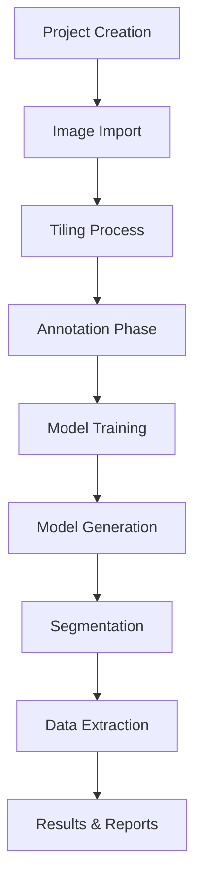
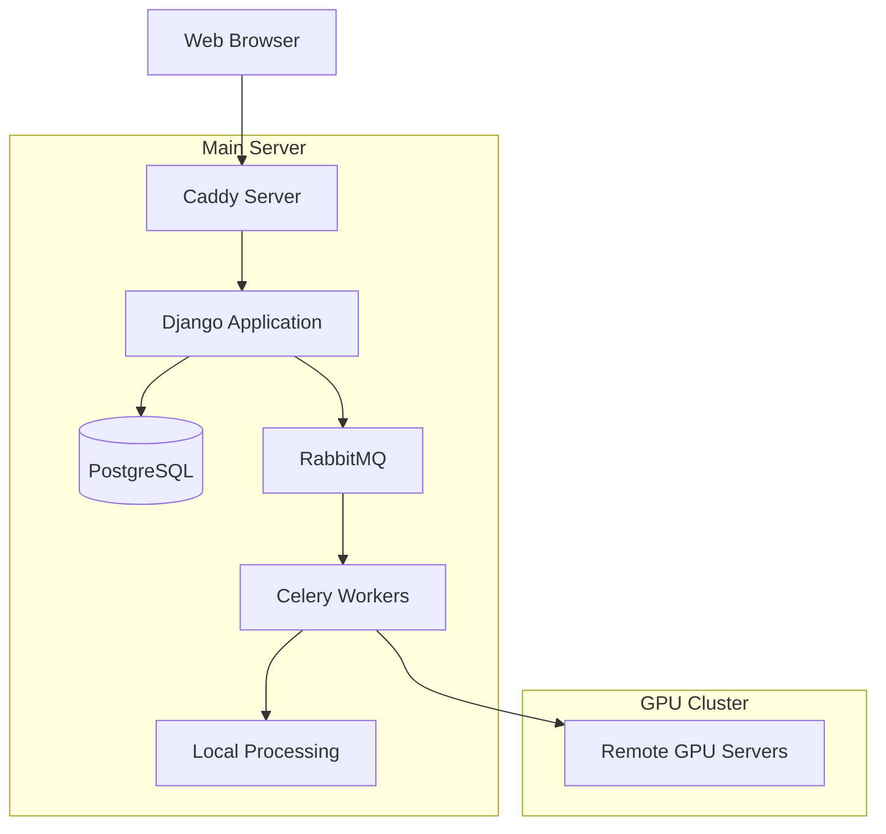
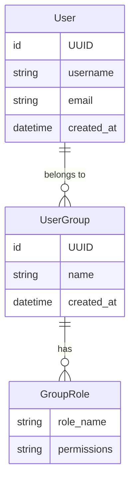
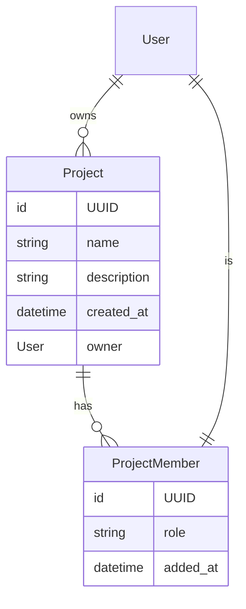
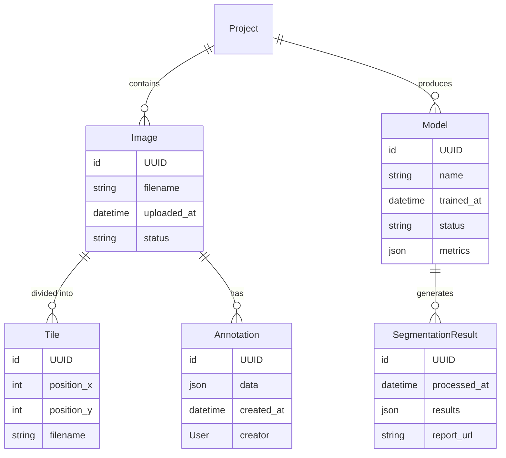
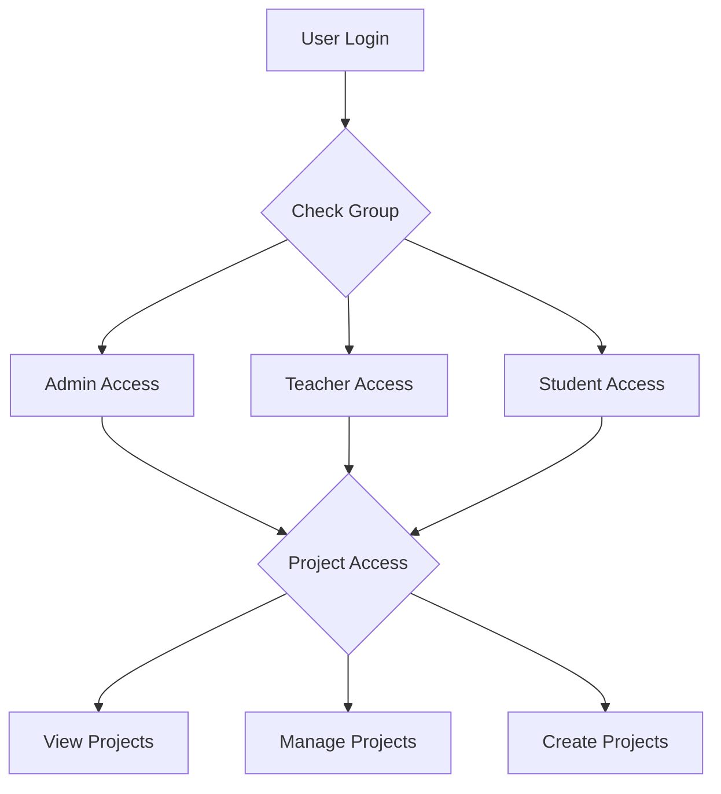

# AI Learning Platform Technical Specification

## Table of Contents
1. Vision and Goals
2. User Personas
3. Workflow Philosophy
4. Technical Architecture
5. Data Model
6. Implementation Methodology
7. Access Control
8. Success Metrics
9. Future Considerations
10. Glossary

## 1. Vision and Goals

### Vision Statement
To create an accessible, educational platform that introduces students to the world of Artificial Intelligence through hands-on experience. By providing a guided, practical approach to image processing, annotation, and model training, students can understand core AI concepts while working with real-world tools and workflows.

### Educational Goals
1. Provide hands-on experience with real AI workflows
2. Demonstrate practical applications of theoretical concepts
3. Introduce industry-standard tools and practices
4. Build confidence in working with AI technologies

### Learning Outcomes
1. Understanding of AI model training process
2. Practical experience with data preparation
3. Knowledge of image processing techniques
4. Familiarity with collaborative AI development
5. Experience with model evaluation and iteration

## 2. User Personas

### Computer Science Professor
- **Role**: Senior Faculty Member
- **Goals**: 
  - Create engaging AI learning experiences
  - Demonstrate practical AI applications
  - Monitor student progress and understanding
  - Bridge theory and practice
- **Pain Points**:
  - Complex setup of AI environments
  - Need for accessible teaching tools
  - Difficulty tracking student progress
  - Limited hands-on resources

### Undergraduate Student
- **Role**: Computer Science Student
- **Goals**:
  - Understand AI fundamentals through practice
  - Gain hands-on experience
  - Build confidence with AI tools
  - Create portfolio projects
- **Pain Points**:
  - Steep learning curve
  - Abstract theoretical concepts
  - Limited practical experience
  - Need for guided learning

### Graduate Research Assistant
- **Role**: Research Team Member
- **Goals**:
  - Support student learning
  - Manage practical sessions
  - Assist with project implementation
  - Guide technical implementation
- **Pain Points**:
  - Resource management
  - Student support requirements
  - Project oversight needs
  - Technical troubleshooting

## 3. Workflow Philosophy and Design

### Understanding the AI Pipeline
The platform's workflow is designed to mirror real-world AI development processes while making them accessible to students. This approach follows a logical progression that builds understanding of AI systems from the ground up:

1. **Data Preparation & Annotation**
   - Students begin by understanding the importance of quality training data
   - Manual annotation teaches what features AI models need to recognize
   - Hands-on experience with data labeling builds intuition about AI capabilities
   - Collaborative annotation introduces real-world team dynamics

2. **Model Training**
   - Using self-annotated data creates direct connection to model behavior
   - Students see how their annotation quality affects model performance
   - Immediate feedback loop between preparation and results
   - Understanding of model iteration and improvement

3. **Application & Analysis**
   - Practical application of trained models demonstrates real-world usage
   - Data extraction teaches post-processing and result interpretation
   - Visualization helps understand model effectiveness
   - Complete pipeline shows end-to-end AI workflow

### Workflow Progression


## 4. Technical Architecture

### System Components


### Docker Infrastructure

```yaml
services:
  web:
    build: .
    volumes:
      - ./projects:/app/projects
    depends_on:
      - postgres
      - redis
      - rabbitmq

  caddy:
    image: caddy:2
    ports:
      - "80:80"
      - "443:443"
    volumes:
      - ./Caddyfile:/etc/caddy/Caddyfile

  postgres:
    image: postgres:13
    environment:
      POSTGRES_DB: aiplatform
      POSTGRES_USER: aiuser

  rabbitmq:
    image: rabbitmq:3-management

  celery_worker:
    build: .
    command: celery -A aiplatform worker
    volumes:
      - ./projects:/app/projects
```

### Project Structure
```
projects/
└── project-{id}/
    ├── input_images/
    │   └── raw images
    ├── annotations/
    │   └── django-labeller output
    ├── models/
    │   └── saved model checkpoints
    └── analysis/
        └── model-{id}/
            └── image-{slug}/
                └── processing results
```

## 5. Data Model

### User Management


### Project Structure


### Project Workflow


## 6. Implementation Methodology

### Phase 1: Foundation (Weeks 1-4)
- Basic platform setup
- Essential AI tools integration
- Learning path structure
- User management

### Phase 2: Core Features (Weeks 5-8)
- Guided tutorials
- Basic AI workflows
- Progress tracking
- Feedback systems

### Phase 3: Advanced Features (Weeks 9-12)
- Advanced AI tools
- Collaborative features
- Assessment tools
- Portfolio system

### Phase 4: Refinement (Weeks 13-16)
- User feedback integration
- Performance optimization
- Additional learning resources
- Extended tool support

## 7. Access Control

### Role-Based Access Control Matrix

| Role | Create Project | Upload Images | Annotate | Train Models | Run Segmentation |
|------|---------------|---------------|----------|--------------|------------------|
| Admin | ✓ | ✓ | ✓ | ✓ | ✓ |
| Professor | ✓ | ✓ | ✓ | ✓ | ✓ |
| Research Assistant | ✓ | ✓ | ✓ | ✓ | ⨯ |
| Student | ⨯ | ✓ | ✓ | ⨯ | ⨯ |

### Access Flow


## 8. Success Metrics

### Learning Metrics
- Concept understanding
- Practical skill development
- Tool proficiency
- Project completion rates

### Technical Metrics
- System uptime and reliability
- Processing speed and efficiency
- Resource utilization
- Error rates and recovery times

### Educational Metrics
- Student engagement and completion rates
- Project success rates
- Learning outcome achievements
- User satisfaction scores

## 9. Future Considerations

### Technical Enhancements
1. Integration with Learning Management Systems (LMS)
2. API development for programmatic access
3. Additional AI model support
4. Enhanced batch processing capabilities

### Educational Features
1. Built-in tutorials and documentation
2. Progress tracking system
3. Project templates for common use cases
4. Automated assessment tools

### Infrastructure Improvements
1. Automated scaling of GPU resources
2. Enhanced security features
3. Backup and recovery systems
4. Performance monitoring tools

## 10. Glossary

| Term | Definition |
|------|------------|
| Project | A container for related images, annotations, and models |
| Annotation | Manual marking of features in images using Django Labeller |
| Tiling | Process of breaking large images into smaller, manageable pieces |
| Training Set | Collection of annotated images used to train AI models |
| Segmentation | AI-powered image analysis to identify specific features |
| Save Node | Checkpoint of a trained model's state |
| RBAC | Role-Based Access Control system |
