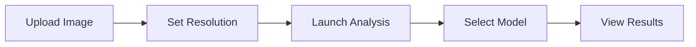
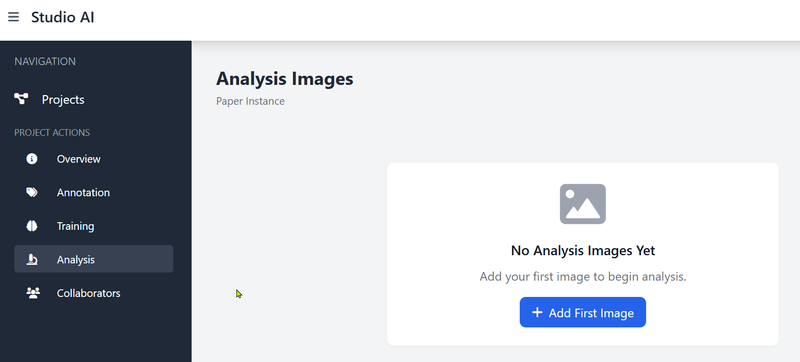
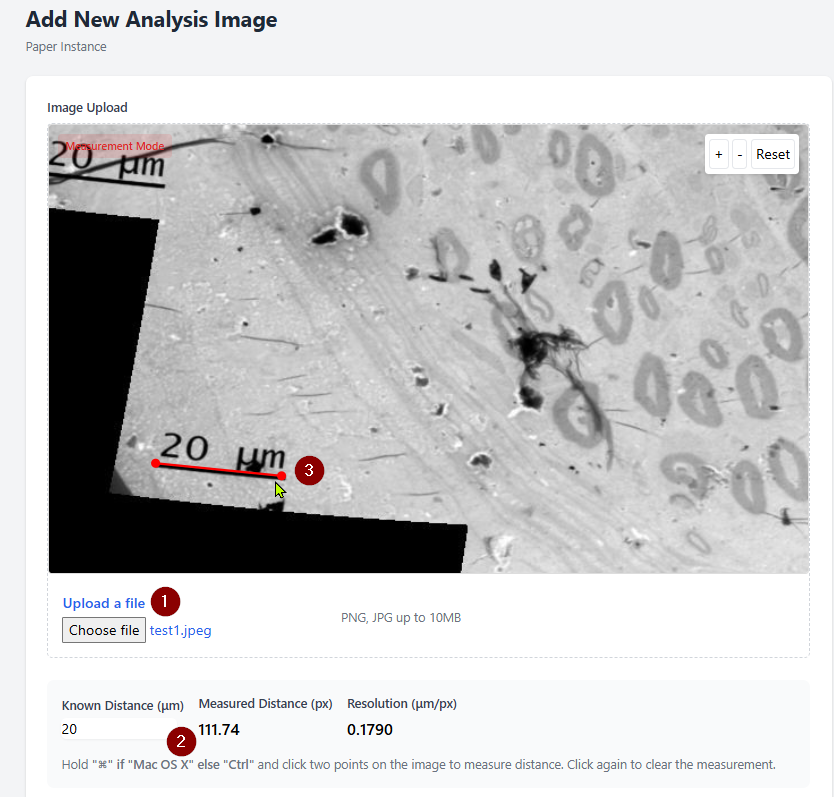
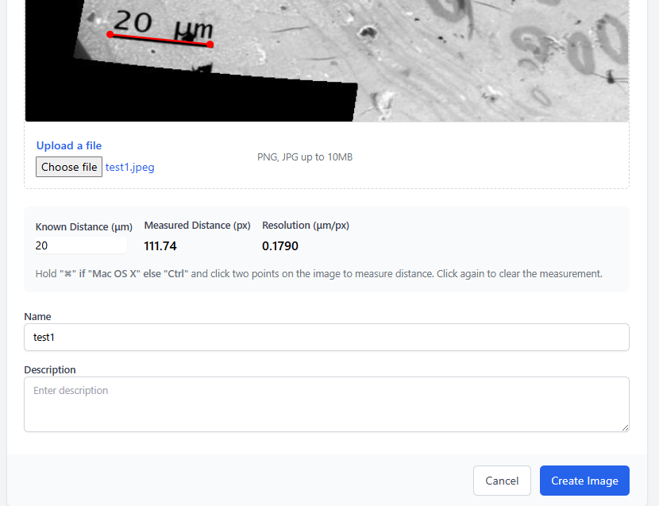
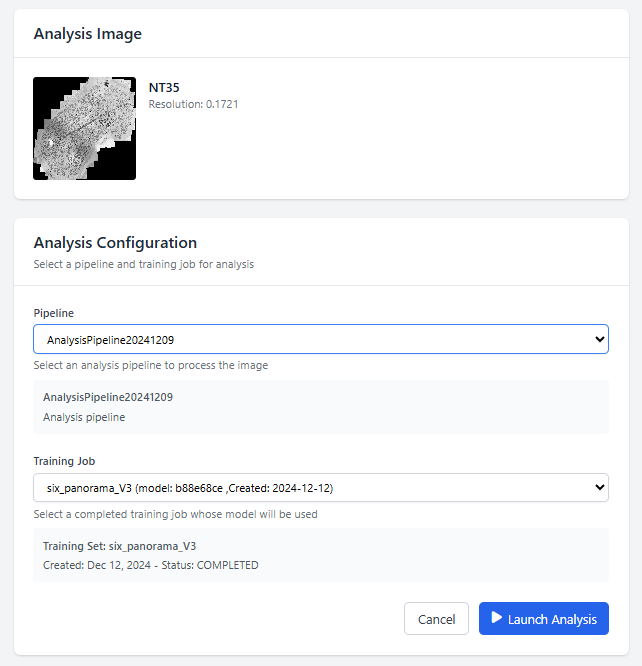
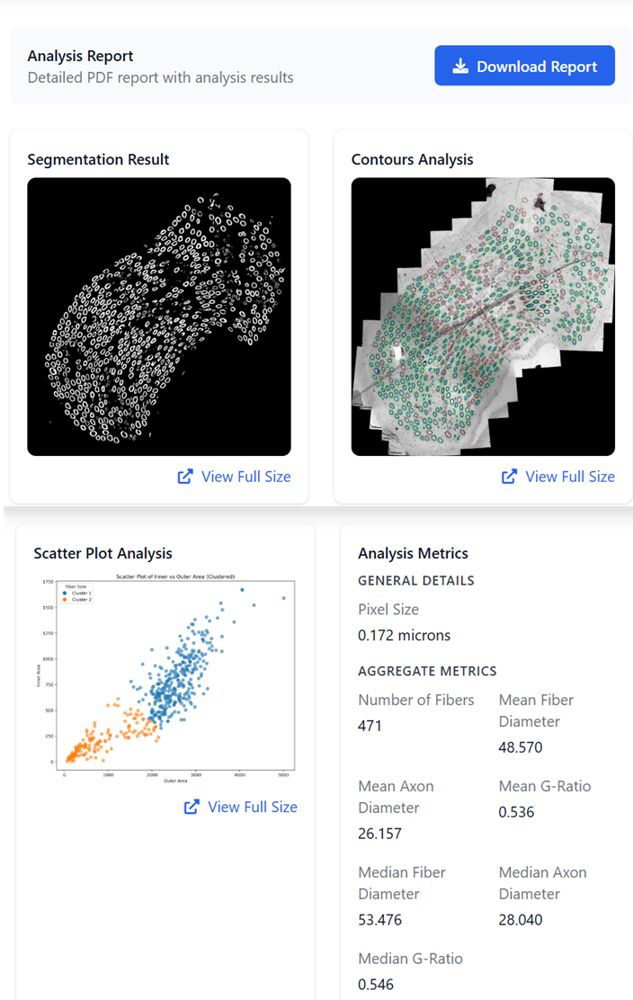
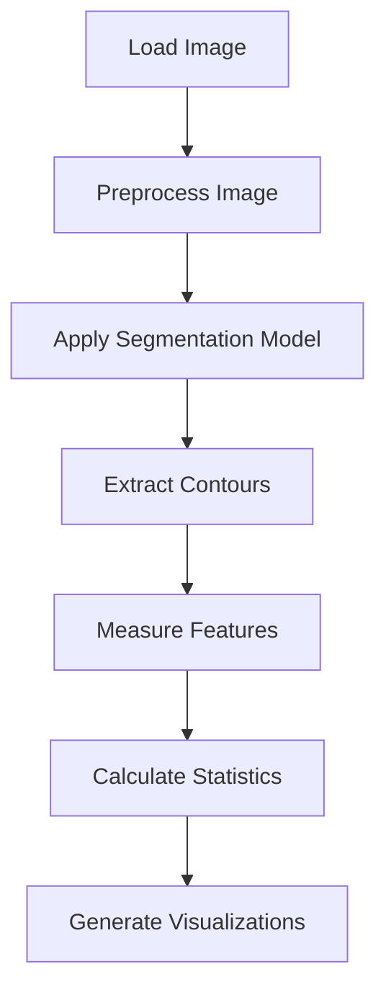

# Image Analysis

The analysis process allows you to apply trained segmentation models to new microscopy images. This guide walks through the steps to analyze images with your trained models.

## Analysis Workflow

## Step 1: Upload an Image

From the Analysis tab, you'll first need to add an image to analyze.

1. Click the "Add New Image" button
2. Select your microscopy image from your computer
3. The image will appear in a new window area

## Step 2: Set the Resolution

For accurate measurements, you need to specify the image resolution.

1. Enter the "Known Distance" in micrometers (μm)
2. Click two points on the scale bar in your image
3. The system will calculate the resolution (μm/pixel)
4. Alternatively, you can directly enter the resolution if known

## Step 3: Provide Image Details

Give your analysis image a name and optional description.

1. Enter a descriptive name for the image
2. Optionally add a detailed description
3. Click "Create Image" to save

## Step 4: Launch Analysis

After uploading, you can run analysis on your image.

1. From the image detail page, click "Launch Analysis"
2. Select a trained model to use (output from a completed training job)
3. Click "Launch Analysis" to begin processing

The analysis job will use the [analysis pipeline script](https://github.com/frontierbio-tech/axons-teaching/blob/main/scripts/run_pipeline_cloud.sh) to perform segmentation and feature extraction.

## Step 5: View Results

Once analysis is complete, you can view and export the results.

The results include:

1. **Segmentation Overlay**: Visualization of detected features
2. **Scatter Plot Analysis**: Distribution of identified structures
3. **Aggregate Metrics**: 
   - Number of fibers detected
   - Mean fiber diameter
   - Mean axon diameter
   - G-ratio (axon diameter/fiber diameter)
   - Other statistical measurements
4. **Download Options**: Export data as CSV for further analysis

## Understanding the Analysis Process

Behind the scenes, the analysis process performs these operations:

The analysis pipeline uses several specialized scripts:

1. **segment_binary.py**: Applies the trained model to segment the image
2. **analyze_axons.py**: Measures properties of the segmented features
3. **generate_pdf_report.py**: Creates a detailed PDF report of findings

## Interpreting Results

### Scatter Plot

The scatter plot shows the relationship between inner (axon) and outer (fiber) areas. Points are typically clustered into groups:
- **Cluster 1** (blue): Normal/myelinated fibers
- **Cluster 2** (orange): Potentially abnormal or unmyelinated fibers

### Metrics

Key metrics to evaluate include:

| Metric | Interpretation |
|--------|----------------|
| Fiber Count | Total number of nerve fibers detected |
| Mean Fiber Diameter | Average diameter of all fibers (including myelin) |
| Mean Axon Diameter | Average diameter of axons (inner part) |
| G-Ratio | Ratio of axon diameter to fiber diameter (typically 0.4-0.7 in healthy tissue) |

## Best Practices

For optimal analysis results:

1. **Image Quality**: Use high-quality, well-focused images
2. **Correct Resolution**: Accurate resolution is critical for meaningful measurements
3. **Appropriate Model**: Use a model trained on similar types of images
4. **Result Validation**: Visually inspect the segmentation to confirm accuracy
5. **Comparative Analysis**: Compare multiple samples using the same model and settings

## Next Steps

After analyzing your images, you can:
- Download measurement data for statistical analysis
- Compare results across multiple samples
- Refine your training model based on analysis performance
- Export visualization for presentations or publications