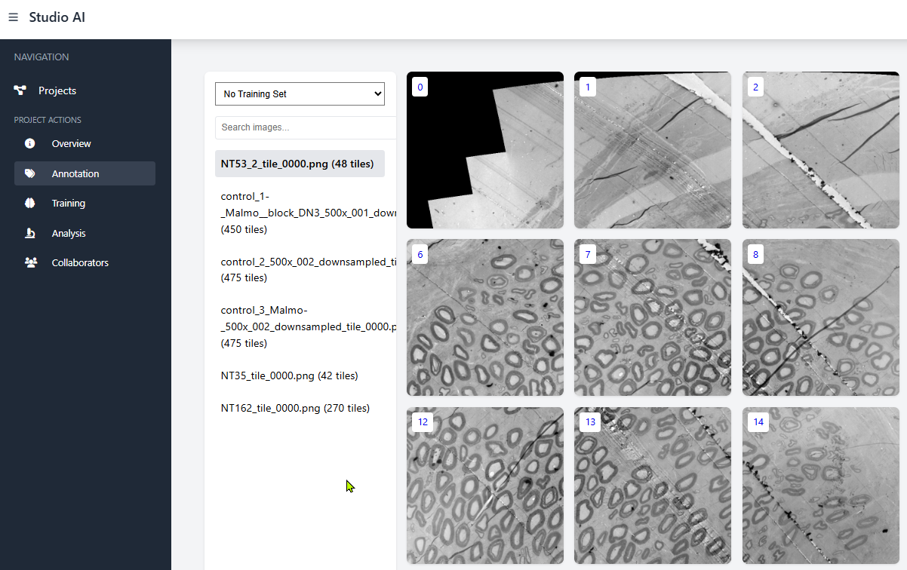
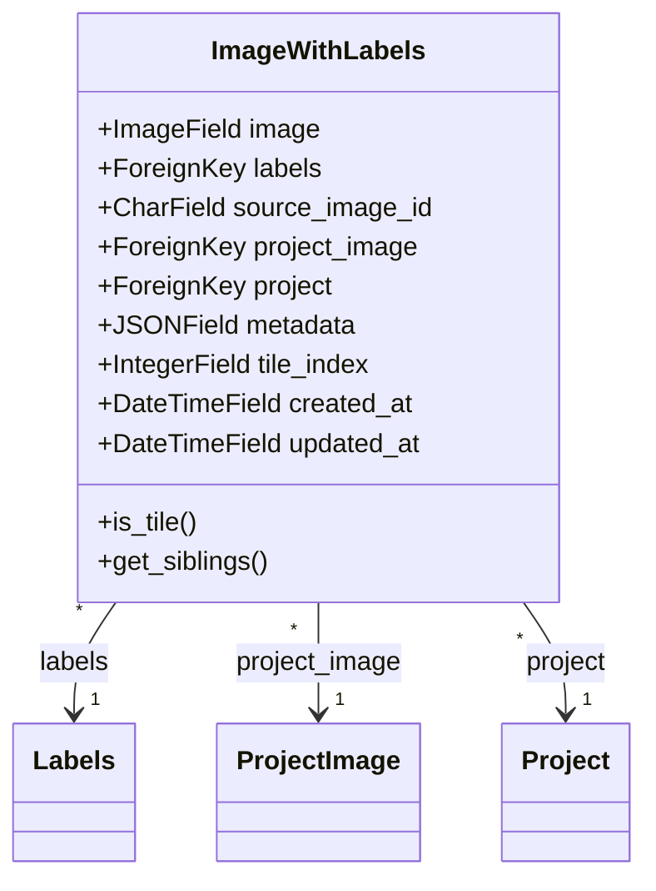
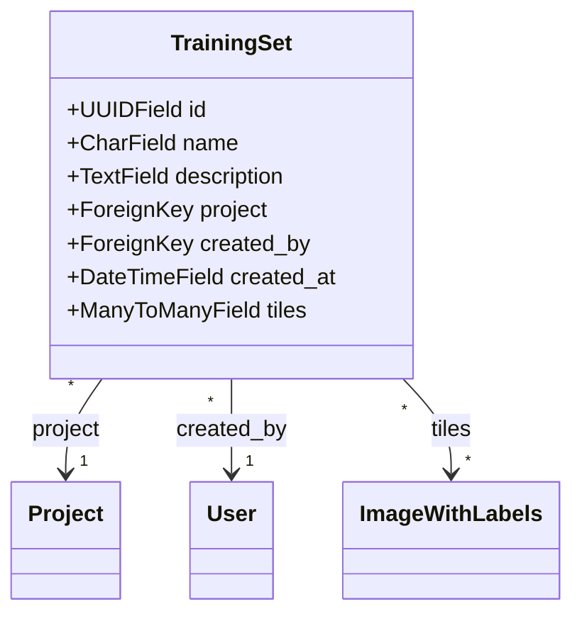
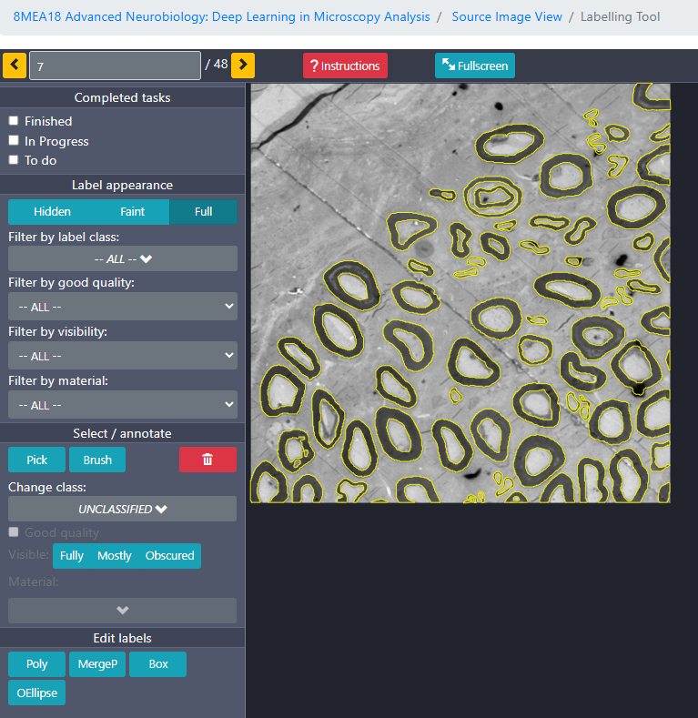

# Annotation and Training Sets

## Overview

The annotation system in Studio.AI is built on the [Django-Labeller](https://github.com/Britefury/django-labeller) open-source tool, integrated with additional functionality for managing training sets. This document explains how annotation works and how to use training sets to organize your annotated tiles for machine learning.

## Annotation Interface

The annotation interface allows users to mark regions of interest in image tiles. After images are uploaded and tiled, they can be accessed through the annotation page.

### Key Features

- **Multiple Annotation Tools**: Draw polygons, rectangles, and other shapes
- **Label Classes**: Assign categories to annotations
- **Image Navigation**: Browse through tiles from the same source image
- **Training Set Management**: Group tiles for machine learning

## Data Model

The annotation system is built around two main models:

### 1. ImageWithLabels

This model connects image tiles with their annotations:

Key aspects:
- Each tile is linked to its source image (`project_image` or legacy `source_image_id`)
- Annotations are stored in the linked `labels` object
- Tiles keep track of their position in the original image (`tile_index`)
- Metadata can store additional information about the tile

### 2. TrainingSet

This model allows grouping tiles for training:

Key aspects:
- Each training set has a name and optional description
- Training sets belong to a specific project
- Tiles are connected through a many-to-many relationship (tiles can be in multiple training sets)
- System tracks who created each training set

## Working with Training Sets

Training sets are collections of tiles that you want to use for training machine learning models. They allow you to:

1. Group relevant tiles together
2. Create different versions of training data
3. Compare performance between different sets
4. Maintain separate training and validation sets

### Creating Training Sets

Training sets can be created in two ways:

1. **From the Annotation Interface**:
   - Select multiple tiles using Shift+click or Ctrl+click
   - Click "Create Training Set" button
   - Enter a name and description
   
2. **From the Training Sets Management Page**:
   - Navigate to Training Sets in the left sidebar
   - Click "Create New Set"
   - Select tiles to include
   - Enter a name and description

### Managing Training Sets

The platform offers several operations for training sets:

1. **Viewing**: Select a training set from the dropdown to view only those tiles
2. **Editing**: Add or remove tiles from existing training sets
3. **Duplicating**: Create a copy of a training set to experiment with variations
4. **Deleting**: Remove training sets that are no longer needed

### Using Training Sets for Machine Learning

When creating a training job, you'll select which training set to use. The system will:

1. Gather all tiles in the selected training set
2. Extract their annotations as masks
3. Use these as training data for the machine learning model

## Annotation Best Practices

For optimal machine learning results, follow these annotation guidelines:

1. **Consistent Annotation**: Be consistent in how you mark similar objects
2. **Complete Coverage**: Annotate all instances of a class in each tile
3. **Precise Boundaries**: Draw annotations that closely follow object boundaries
4. **Balanced Training Sets**: Include a diverse range of examples in your training sets
5. **Version Control**: Create multiple training sets to compare different annotation approaches

## Training Set Organization Strategies

Consider these approaches to organizing your training sets:

1. **By Data Source**: Group tiles from the same original image or experiment
2. **By Feature Type**: Create sets focused on specific features or structures
3. **Train/Validation Split**: Create separate sets for training and validation
4. **Difficulty Levels**: Group easy and challenging examples separately
5. **Iterative Improvement**: Create new versions as you refine your annotations

## Technical Details

### Annotation Storage

Annotations are stored using Django-Labeller's format:

1. **JSON Format**: Annotations are stored as structured JSON
2. **Polygon Representation**: Regions are stored as series of points
3. **Label Classification**: Each annotation has an associated class

### Training Set Implementation

Training sets use a many-to-many relationship with tiles, allowing:

1. **Flexible Grouping**: Tiles can belong to multiple training sets
2. **Efficient Queries**: Fast retrieval of all tiles in a set
3. **Metadata Preservation**: Training set details are maintained separately from tile data

## Related Documentation

- [Tiling Process](tiling)
- [Training Pipeline](training)
- [Django-Labeller Documentation](https://github.com/Britefury/django-labeller)