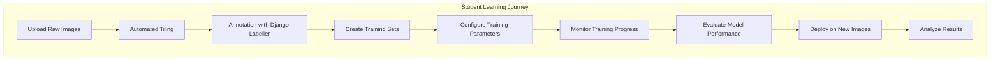
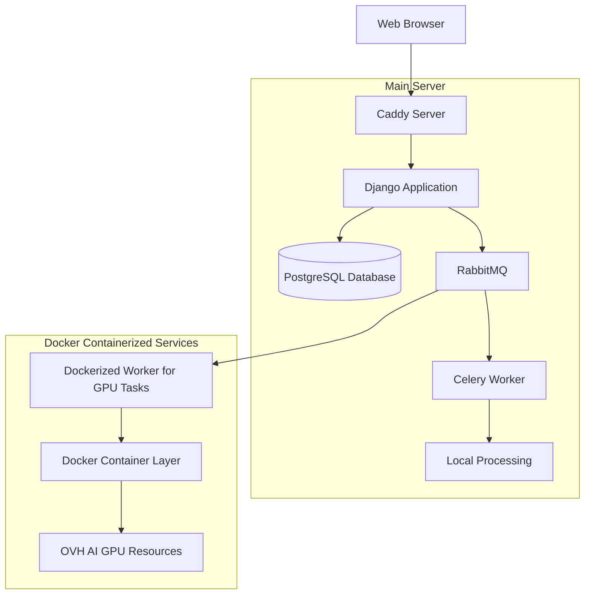
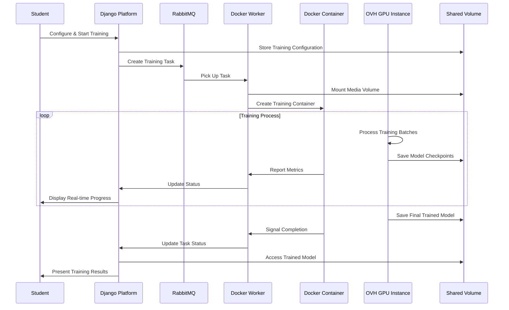
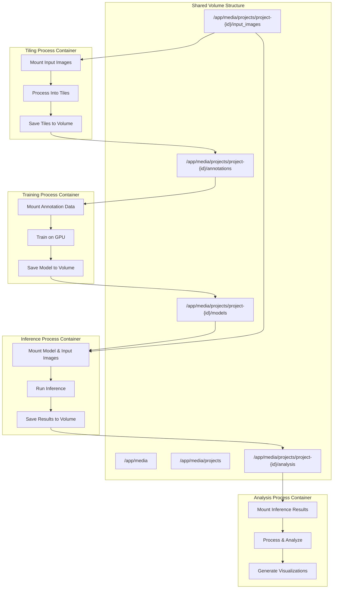

# Studio: Technical Overview

## Docker-Containerized Processing Architecture
The Studio platform leverages Docker technology to create a consistent, reproducible environment for all computational processes, including tiling, training, inference, and analysis. This ensures students experience a reliable AI workflow without technical complexity. Data is seamlessly shared across various stages through carefully managed storage.

## AI Learning Workflow
The AI learning process guides students through clearly defined steps:

## System Architecture
Studio operates with a user-friendly web interface connected to powerful backend services:

- **Web Browser** communicates with a **Caddy Server**, which manages secure connections.
- **Django Application** orchestrates tasks and manages data using a **PostgreSQL Database**.
- **RabbitMQ** coordinates communication and manages tasks between services.
- **Local Processing** tasks are handled on the main server, while **GPU-intensive tasks** are executed in Docker containers using external GPU resources.

## Docker-Based Infrastructure
The platform is structured around Docker containers, each specialized for different tasks:

- **Studio AI Container:** Manages the main Django application.
- **Caddy Container:** Provides secure, fast access to the web interface.
- **RabbitMQ Container:** Facilitates communication between components.
- **Worker Containers:** Perform local and GPU-based tasks (tiling, training, inference, analysis).
- **Shared Volumes:** Store media and project data accessible by all containers.

## GPU Training Workflow
Students configure and launch AI training through an intuitive interface:

## Dockerized Processing Workflow
Studio uses a clear workflow for data processing:

## Conclusion
Studio simplifies complex AI workflows through Docker containerization, enabling students to focus on learning and practical AI development without extensive technical overhead. This design mirrors professional AI environments, ensuring real-world applicability and enhancing educational value.

