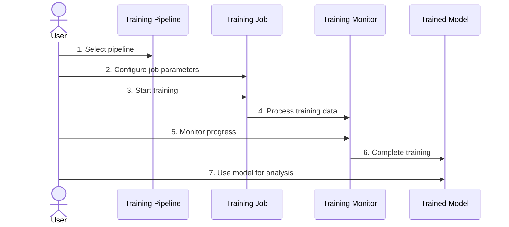
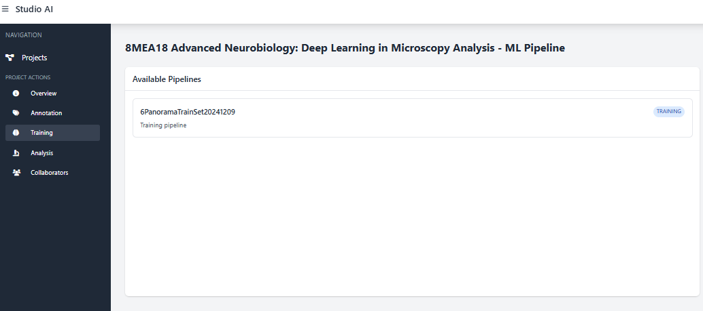
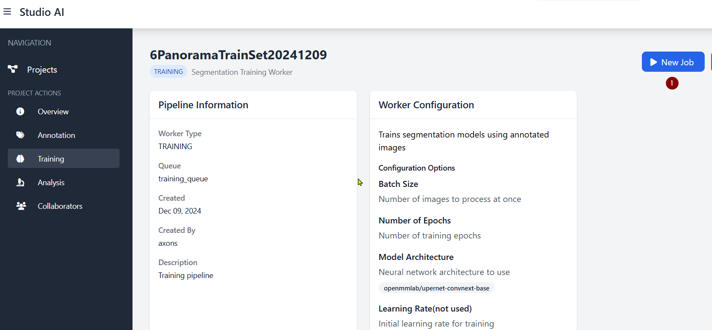
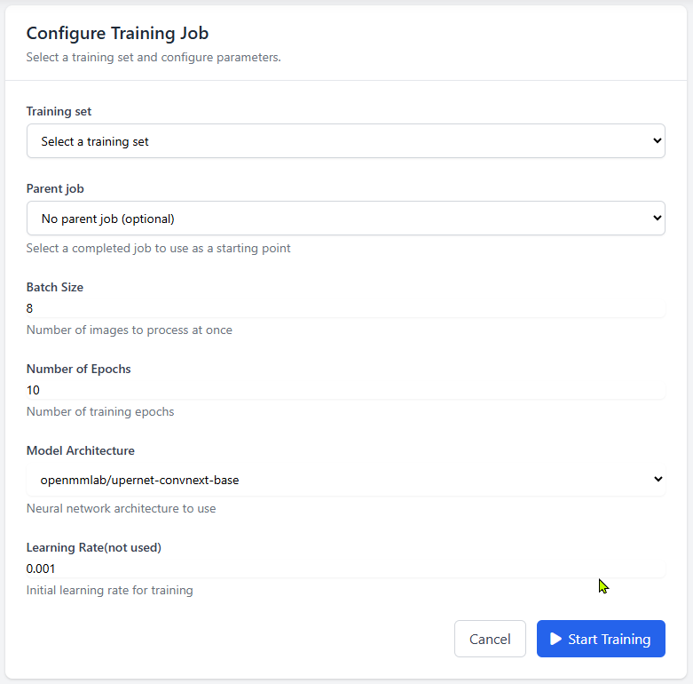
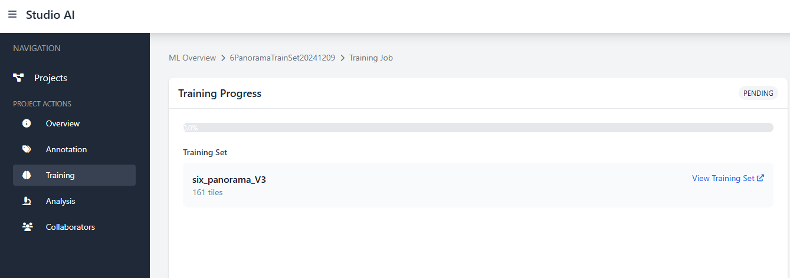
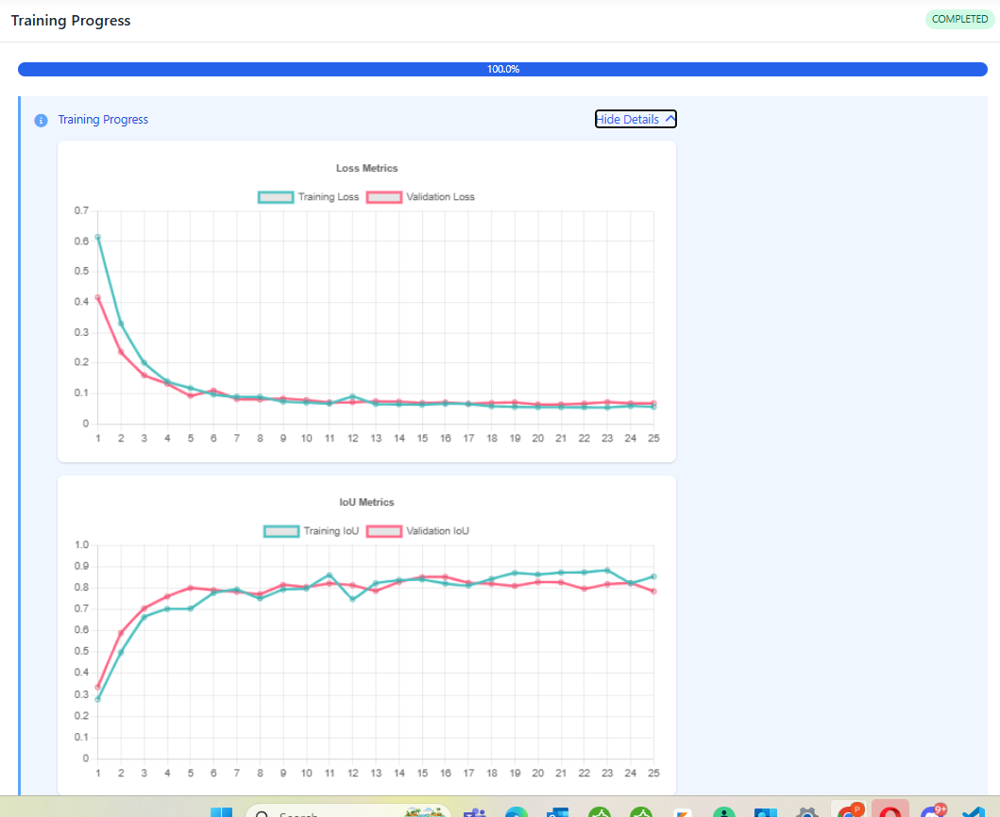
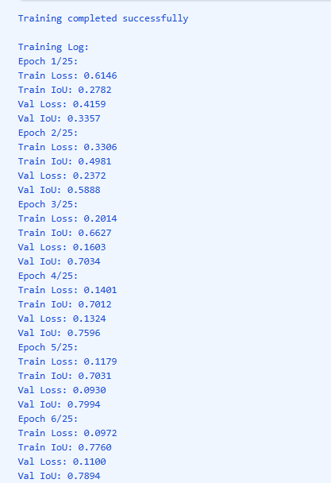
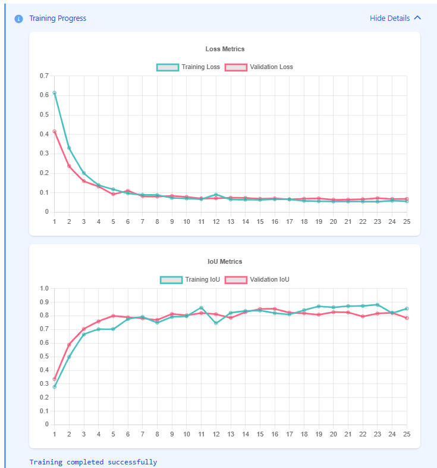
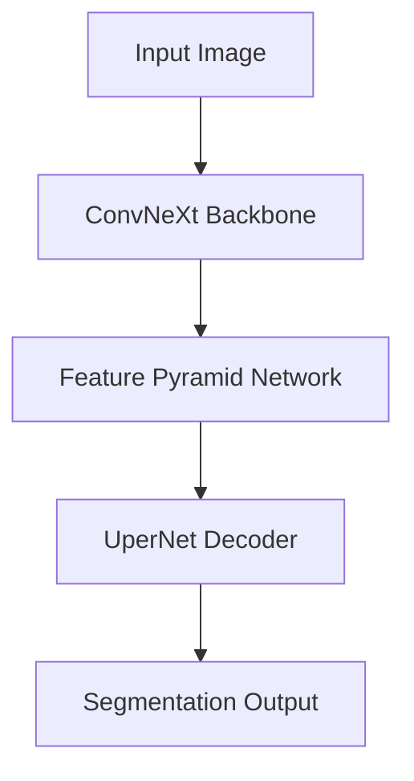
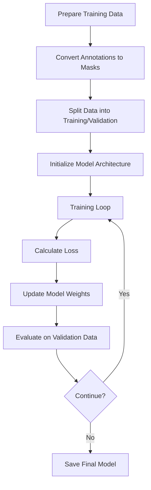

# Training Process

## Overview

The training process allows you to train segmentation models using your annotated image tiles. This guide focuses on the practical steps to create and monitor training jobs.

## Training Workflow

The ML training workflow follows these key steps:



## Step 1: Select a Training Pipeline

From the ML page, you can see available pipelines. Each pipeline is configured for a specific type of task.



## Step 2: Create a New Training Job

After selecting a pipeline, click the "New Job" button to create a new training task.



## Step 3: Configure Job Parameters

On the job configuration page, set up the parameters for your training:



Key parameters include:

- **Training Set**: Select your annotated tile set
- **From Model** (optional): Use a previous model as a starting point
- **Batch Size**: Number of images to process at once (default: 8)
- **Number of Epochs**: Total training iterations (default: 10-50)
- **Model Architecture**: Neural network architecture to use
- **Learning Rate**: Step size for model optimization (default: 0.001)

## Step 4: Start Training

Click "Start Training" to begin the training process.



## Step 5: Monitor Training Progress

During training, you can monitor progress and metrics in real-time:



The monitoring interface shows:

- **Overall Progress**: Percentage of training completed
- **Loss Graph**: Shows how well the model is learning
  - Training loss (blue): Error on training data
  - Validation loss (red): Error on validation data
- **IoU Graph**: Shows segmentation accuracy
  - Training IoU (blue): Accuracy on training data
  - Validation IoU (red): Accuracy on validation data

## Understanding Training Metrics

### Loss Values

The loss curves show how well the model is learning:
- Decreasing loss = model is improving
- Flattening loss = learning is slowing down
- Increasing validation loss = potential overfitting

### Intersection over Union (IoU)

IoU measures the accuracy of segmentation:
- IoU = Area of Overlap / Area of Union
- Values range from 0 to 1 (higher is better)
- Values above 0.8 generally indicate good segmentation

### Typical Training Progress

A successful training run shows these patterns:

```
Epoch 1/50:
  Train Loss: 0.4920, Train IoU: 0.3247
  Val Loss: 0.4455, Val IoU: 0.4499

Epoch 25/50:
  Train Loss: 0.0411, Train IoU: 0.8979
  Val Loss: 0.0536, Val IoU: 0.8759

Epoch 50/50:
  Train Loss: 0.0417, Train IoU: 0.8503
  Val Loss: 0.0563, Val IoU: 0.8750
```

## Step 6: View Completed Model

Once training completes, the model is automatically saved and becomes available for analysis tasks.



## Model Architecture

The default model architecture is UperNet with ConvNeXt-base backbone, which is effective for segmentation tasks:



UperNet combines:
- Powerful CNN backbone (ConvNeXt)
- Multi-scale feature extraction
- Effective decoder for detailed segmentation

## Training Process Behind the Scenes

While you don't need to understand all technical details, here's a simplified view of what happens during training:



## Best Practices

For optimal training results:

1. **Quality Annotations**: Ensure annotations are accurate and consistent
2. **Sufficient Data**: Include at least 50-100 annotated tiles in your training set
3. **Diverse Examples**: Include various examples that represent what you want to detect
4. **Monitor Validation Metrics**: Watch for signs of overfitting (validation loss increases while training loss decreases)
5. **Iteration**: Start with default parameters, then create new jobs with adjusted parameters based on results
6. **Transfer Learning**: For incremental improvements, use a previous model as a starting point