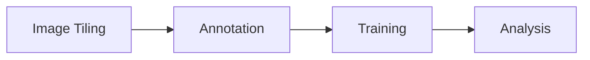
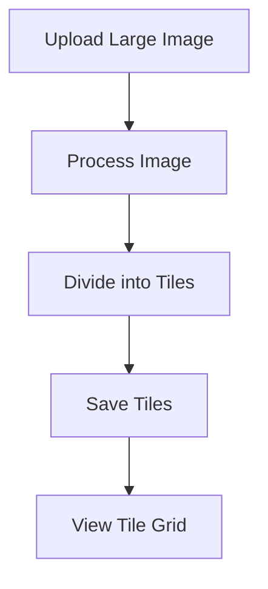
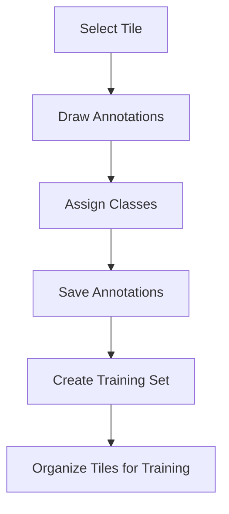
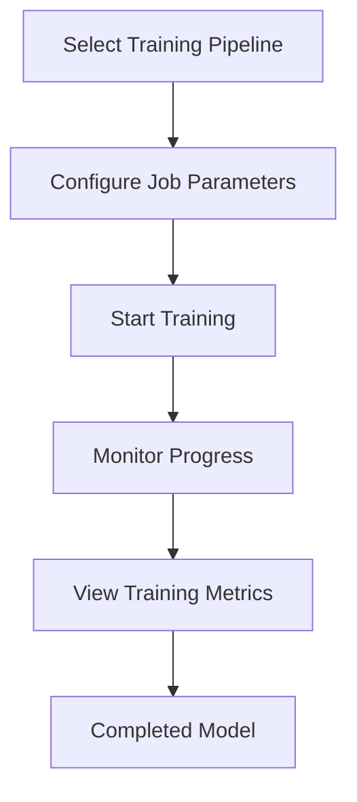
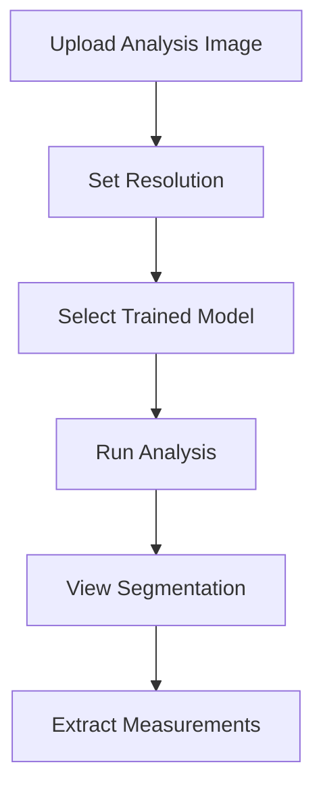
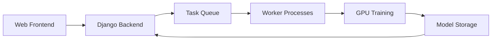

# Introduction to Studio

Welcome to Studio, a comprehensive platform designed to introduce students to the complete machine learning workflow for microscopy image analysis. This platform guides you through the entire process from data preparation to model application.

## Platform Overview

Studio provides an end-to-end solution for applying artificial intelligence to microscopy image analysis. The platform is structured around four key processes:

### Key Components

1. **Image Tiling**: Divide large microscopy images into manageable pieces
2. **Annotation**: Mark features of interest in these tiles
3. **Training Sets**: Organize annotated tiles for machine learning
4. **Model Training**: Train segmentation models on annotated data
5. **Analysis**: Apply trained models to new images for automated analysis

## The Machine Learning Workflow

Understanding the complete workflow is essential for successful AI-driven image analysis:

### 1. Image Tiling Process

Large microscopy images are divided into smaller tiles that are easier to process and annotate.

- Upload large source images
- Automatic tiling into standardized pieces
- Consistent organization for further processing

[Learn more about Image Tiling →](Processes/tiling)

### 2. Annotation and Training Sets

Tiles are manually annotated to identify features of interest, then organized into training sets.

- Draw annotations on tiles using various tools
- Assign classes to annotations
- Group annotated tiles into training sets

[Learn more about Annotation →](Processes/annotation)

### 3. Machine Learning Training

Training sets are used to train segmentation models that can automatically identify features.

- Configure training parameters
- Train models on annotated data
- Monitor progress and evaluate results

[Learn more about Training →](Processes/training)

### 4. Image Analysis

Trained models are applied to new images to automatically detect and measure features.

- Upload new images for analysis
- Apply trained models
- View results and extract measurements

[Learn more about Analysis →](Processes/analysis)

## Educational Value

Studio is designed with educational goals in mind:

- **Hands-on Experience**: Work with real-world AI workflows
- **Practical Application**: Bridge theoretical concepts with implementation
- **End-to-End Understanding**: See the complete AI pipeline in action
- **Tangible Results**: Generate measurable outcomes from your work

## Getting Started

To begin using Studio:

1. **Create a Project**: Set up a workspace for your microscopy analysis
2. **Upload Images**: Provide source images for tiling and analysis
3. **Follow the Workflow**: Progress through tiling, annotation, training, and analysis

Each step has detailed documentation accessible through the sidebar navigation.

## Technical Foundation

Studio is built on modern technologies:

- Web-based interface for accessibility
- Advanced segmentation models (UperNet, ConvNeXt)
- Distributed processing for handling large datasets
- Integration with GPU acceleration for training

## Example Applications

Studio can be applied to various microscopy analysis tasks:

- **Neuroanatomy**: Analyze nerve fibers and axon segmentation
- **Histopathology**: Identify cell structures in tissue samples
- **Materials Science**: Measure properties of material structures
- **Biological Imaging**: Quantify features in various biological specimens

Explore the documentation to learn more about each component of the platform and how to use Studio for your microscopy analysis needs.

