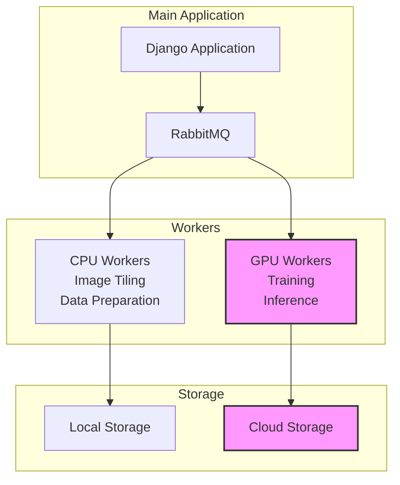
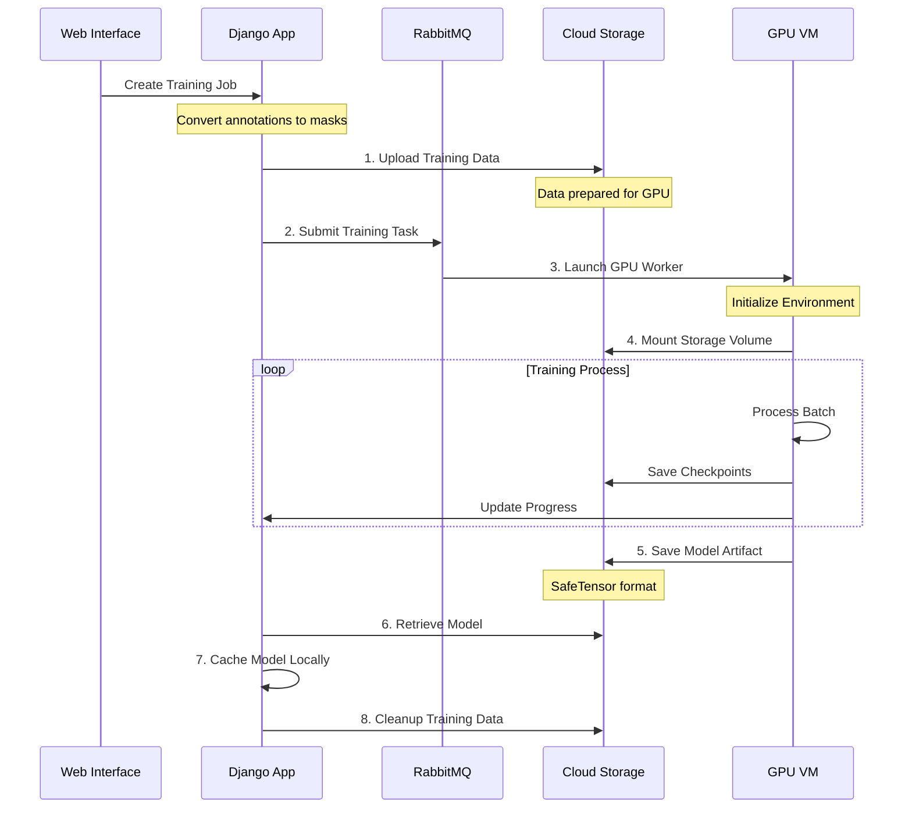
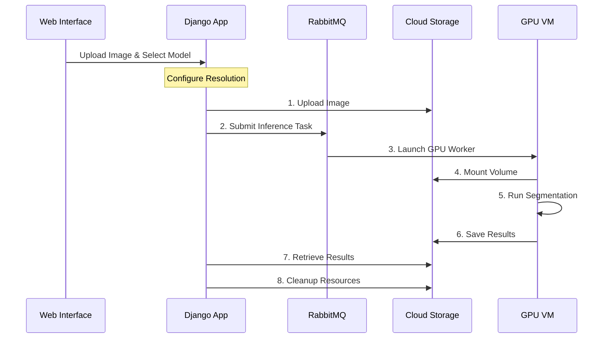
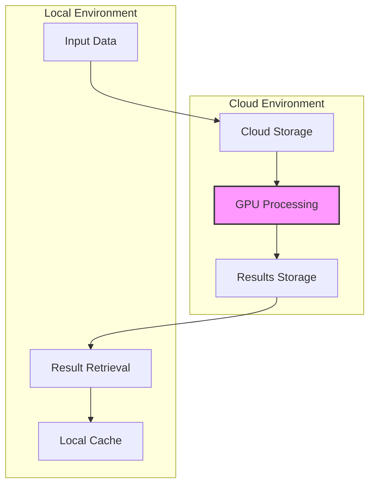
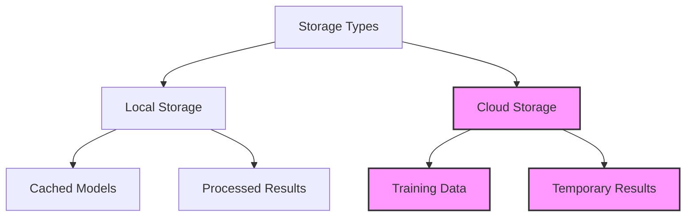

# AI Learning Platform: GPU Processing Architecture & Implementation

## Overview

The AI Learning Platform is an educational system that provides students with practical AI experience through both web-based and local development options. The platform delegates GPU-intensive computations to specialized workers, which are implemented using on-demand GPU resources. This document outlines the current implementation and GPU workflow requirements for Azure integration.

## System Architecture

The platform separates processing into two distinct worker types:



## GPU Workers Implementation

Two specialized GPU workers handle computationally intensive tasks:

### Training Worker
Purpose: Model training using annotated datasets
Current Configuration:
- Docker image: axons-train:latest
- GPU Requirements: NVIDIA T4 or better
- Memory: 16GB GPU RAM minimum
- Storage: Mounted cloud volume

### Inference Worker
Purpose: Image segmentation and analysis
Current Configuration:
- Docker image: axons-train:latest (different entrypoint)
- GPU Requirements: NVIDIA T4 or better
- Memory: 8GB GPU RAM minimum
- Storage: Mounted cloud volume

## Training Process Workflow



## Inference Process Workflow



## Implementation Details

### Data Flow



### GPU Worker Lifecycle

The workers follow a specific lifecycle to ensure efficient resource usage:

1. **Initialization**
   - Worker container starts
   - GPU availability check
   - Storage volume mounting
   - Environment preparation

2. **Processing**
   - Data loading from mounted volume
   - GPU computation execution
   - Progress tracking
   - Result saving

3. **Cleanup**
   - Result verification
   - Data transfer completion
   - Resource release
   - Volume unmounting

### Current Resource Requirements

Training Worker:
```json
{
    "gpu_type": "NVIDIA T4",
    "gpu_memory": "16GB",
    "system_memory": "32GB",
    "storage": "100GB minimum",
    "network": "10Gbps"
}
```

Inference Worker:
```json
{
    "gpu_type": "NVIDIA T4",
    "gpu_memory": "8GB",
    "system_memory": "16GB",
    "storage": "50GB minimum",
    "network": "10Gbps"
}
```

## Storage Integration

The platform implements a tiered storage approach:



### Storage Workflow

1. **Data Upload**
   - Validation
   - Conversion if needed
   - Cloud storage transfer

2. **Processing Storage**
   - Volume mounting
   - Temporary workspace
   - Checkpoint saving

3. **Result Management**
   - Result validation
   - Local transfer
   - Cloud cleanup

## Integration Requirements for Azure

### Required Services
- Azure Kubernetes Service (AKS) with GPU nodes
- Azure Storage Account
- Azure Container Registry

### Network Requirements
- Outbound access to storage
- Internal network for worker communication
- Secure communication with main application

### Security Requirements
- RBAC for resource access
- Storage encryption
- Network isolation
- Secure credential management
