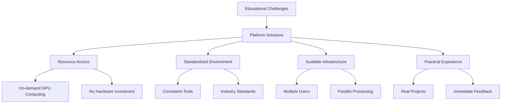
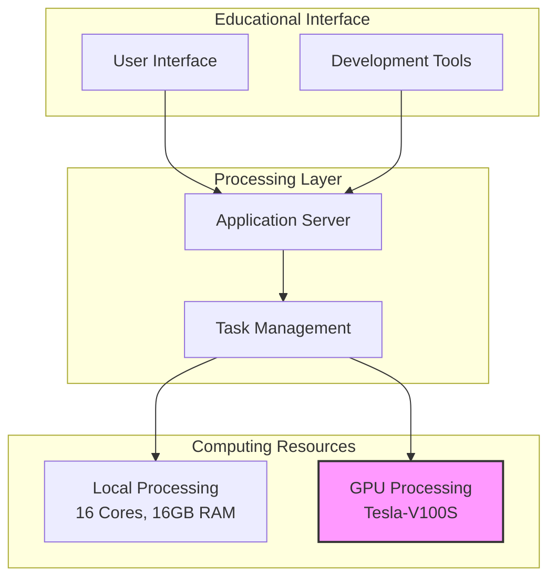
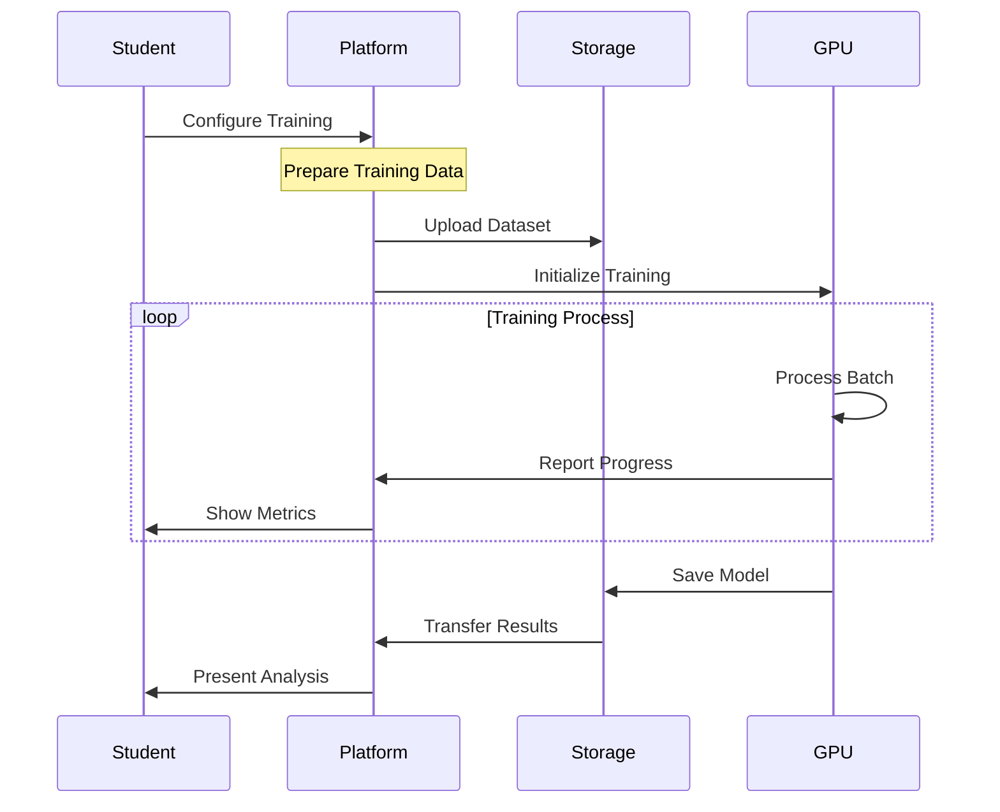
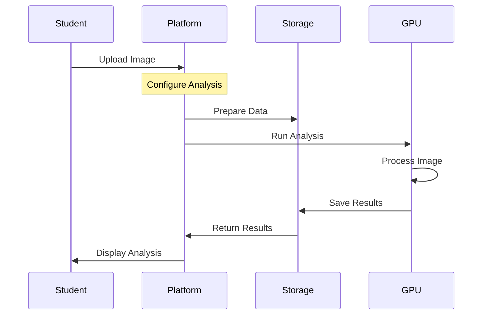
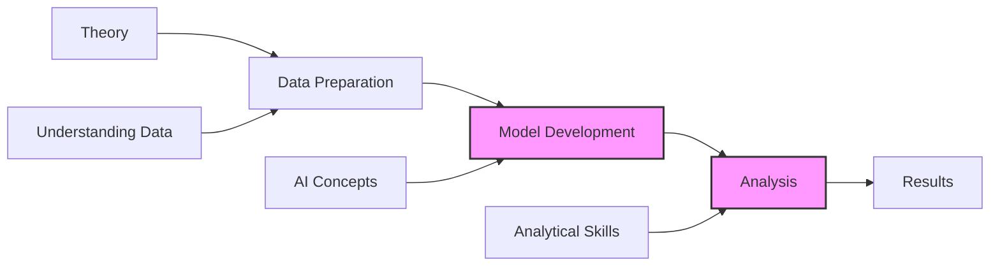
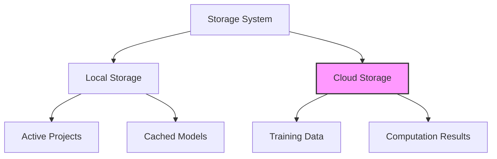

# AI Learning Platform: Bridging Theory and Practice in AI Education

## Executive Summary

The AI Learning Platform represents a significant advancement in artificial intelligence education, providing universities with a powerful tool to bridge the gap between theoretical knowledge and practical implementation. The platform combines enterprise-grade GPU computing resources with an intuitive educational interface, enabling students to gain hands-on experience with real-world AI development workflows.

## Educational Context and Impact

### Transforming AI Education

Traditional AI education often faces significant challenges in providing students with practical experience. Many educational institutions struggle with:

1. Limited access to high-performance computing resources
2. Difficulties in providing consistent development environments
3. Challenges in scaling resources for larger classes
4. Barriers between theoretical concepts and practical application

Our platform addresses these challenges by providing:



### Learning Outcomes

The platform enables students to develop crucial skills through practical experience:

1. Understanding of complete AI workflows
2. Experience with data preparation and annotation
3. Practical model training and optimization
4. Real-world problem-solving abilities
5. Familiarity with industry-standard tools

## System Architecture and Implementation

### Current Infrastructure

The platform operates on a hybrid infrastructure combining local computing resources and on-demand GPU capabilities:

**Local Server Resources**
- vCores: 16
- Memory: 16 GB
- Storage: 160 GB
- Purpose: Handling web interface, data preparation, and coordination

**On-Demand GPU Resources**
- CPU: 13 cores
- RAM: 40 GiB
- GPU: 1 x Tesla-V100S
- Purpose: High-performance computing tasks, model training, and inference

### Workflow Architecture



## Technical Implementation

### GPU-Accelerated Learning Workflows

The platform implements two primary GPU-accelerated workflows essential for AI education:

1. **Model Training Process**



2. **Analysis and Inference**



### Resource Utilization

The platform intelligently manages computing resources to provide:

1. **Efficient Processing**
   - Local servers handle web interface and data preparation
   - GPU resources allocated only for intensive computations
   - Automatic resource cleanup after task completion

2. **Scalable Architecture**
   - Support for multiple simultaneous users
   - Dynamic resource allocation
   - Efficient workload distribution

## Educational Workflows

### Practical Learning Path

Students follow a structured path that integrates theoretical knowledge with practical application:



### Hands-on Components

The platform supports several key educational activities:

1. **Data Preparation**
   - Image processing and tiling
   - Data annotation and labeling
   - Dataset organization

2. **Model Development**
   - Training configuration
   - Performance monitoring
   - Model optimization

3. **Analysis and Application**
   - Model application
   - Result analysis
   - Performance evaluation

## Technical Details

### Processing Capabilities

The platform leverages powerful computing resources:

**Local Processing Server**
```json
{
    "vCores": 16,
    "Memory": "16 GB",
    "Storage": "160 GB",
    "Purpose": "Web interface, data preparation, coordination"
}
```

**GPU Computing Resources**
```json
{
    "CPU": "13 cores",
    "RAM": "40 GiB",
    "GPU": "Tesla-V100S",
    "Purpose": "Model training, inference, high-performance computing"
}
```

### Storage Architecture

The platform implements an efficient storage system:



## Conclusion

The AI Learning Platform provides a comprehensive solution for modern AI education, combining powerful computing resources with an intuitive learning interface. Its implementation of industry-standard tools and workflows, supported by high-performance GPU computing, enables universities to deliver practical, hands-on AI education at scale.

The platform's architecture ensures efficient resource utilization while providing students with authentic AI development experience. This approach not only enhances learning outcomes but also prepares students for real-world AI development challenges.
