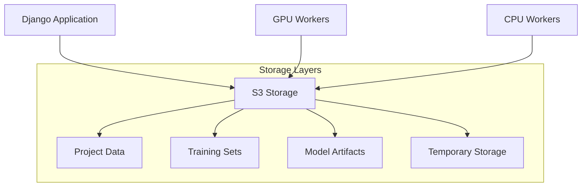
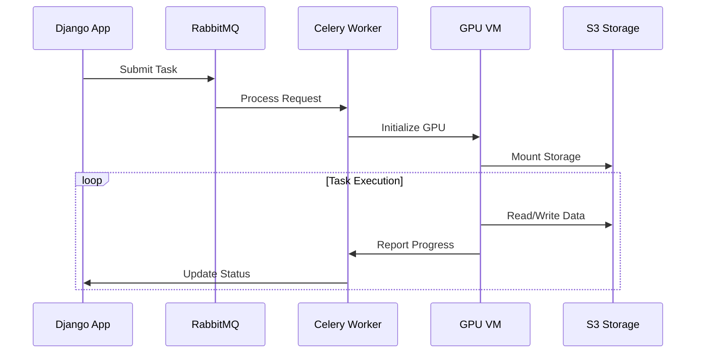
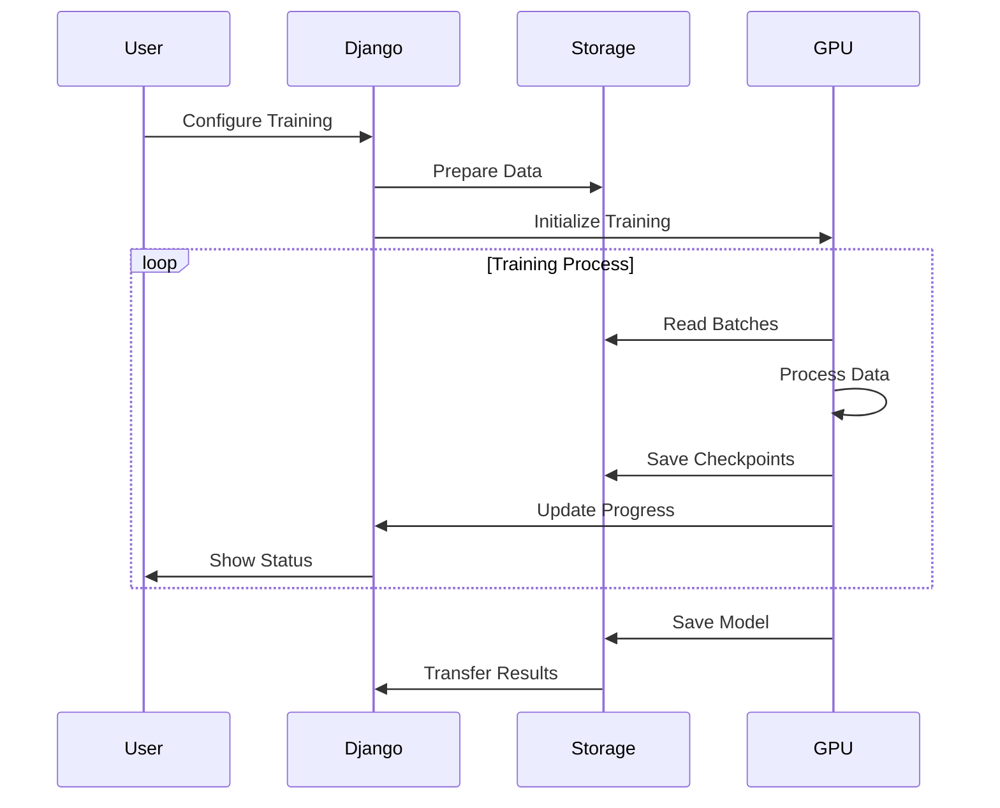
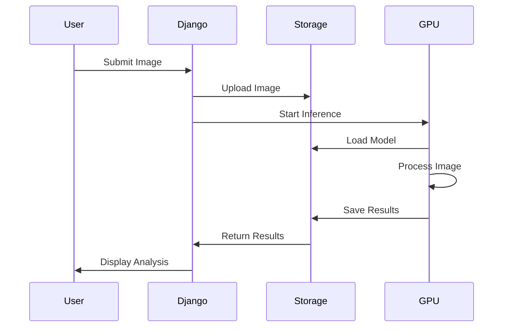

# AI Learning Platform: Comprehensive Technical Documentation

## Executive Summary

The AI Learning Platform represents a sophisticated educational tool designed to bridge the gap between theoretical artificial intelligence concepts and practical implementation. By combining modern web technologies, powerful GPU computing resources, and an intuitive educational interface, the platform enables students to gain hands-on experience with real-world AI development workflows while providing institutions with a scalable, efficient solution for AI education.

## Platform Architecture

### Core Application Framework

At its heart, the platform is built as a Django web application, leveraging Django's robust framework and extensive ecosystem. This architectural choice provides a solid foundation for handling complex educational workflows while ensuring security, scalability, and maintainability. The Django application manages several crucial aspects of the platform:

1. **User Management and Authentication**
   - Role-based access control for students, educators, and administrators
   - Secure authentication workflows
   - Permission management for different platform features
   - Session handling and security

2. **Data Models and Database Interactions**
   - Efficient project organization and management
   - Training set and model tracking
   - User progress and activity monitoring
   - Result storage and analysis

3. **Web Interface and API Endpoints**
   - Intuitive user interface for educational workflows
   - RESTful APIs for worker communication
   - Real-time progress monitoring
   - Resource management interfaces

4. **Template System and Frontend Integration**
   - Dynamic content rendering
   - Interactive educational interfaces
   - Progress visualization
   - Real-time feedback systems

### Storage Architecture

The platform utilizes an S3-compatible object storage system that provides scalable, reliable data management for all platform components. This storage architecture offers several key advantages:

The storage system provides:
1. **Scalable Data Management**
   - Efficient handling of large datasets
   - Automatic scaling based on usage
   - Cost-effective long-term storage
   - Data lifecycle management

2. **Secure Access Control**
   - Fine-grained permission management
   - Secure data transfer
   - Encryption at rest and in transit
   - Access logging and monitoring

3. **Efficient Resource Utilization**
   - Direct access for GPU workers
   - Optimized data transfer paths
   - Automatic cleanup of temporary data
   - Caching for frequently accessed files

### Computing Infrastructure

The platform combines local computing resources with powerful GPU-enabled virtual machines to provide a comprehensive computing environment:

1. **Local Processing Servers**
   - Configuration: 16 vCores, 16 GB RAM, 160 GB Storage
   - Handles web application hosting
   - Manages user interactions
   - Coordinates resource allocation
   - Processes routine computational tasks

2. **GPU-Enabled Virtual Machines**
   - Hardware Specifications:
     - CPU: 13 cores
     - System Memory: 40 GiB RAM
     - GPU: NVIDIA Tesla V100S
       - 32GB GPU Memory
       - 130 TeraFLOPS AI Performance
   - Software Configuration:
     - Custom Docker image (ghcr.io/mupacif/axons-ovh:latest)
     - Optimized deep learning frameworks
     - CUDA and cuDNN support
     - Automated resource management

The GPU virtual machines are dynamically provisioned based on computational demands. Each VM:
- Mounts S3 storage for direct data access
- Runs our specialized Docker container
- Handles either training or inference tasks
- Automatically cleans up after task completion

## Workflow Implementation

### Task Distribution System

The platform uses a sophisticated task distribution system built on Celery and RabbitMQ:

This system enables:
1. **Efficient Resource Management**
   - Asynchronous task processing
   - Automatic worker scaling
   - Resource optimization
   - Error handling and recovery

2. **Real-time Monitoring**
   - Progress tracking
   - Resource utilization monitoring
   - Performance metrics
   - Status updates

### Training Implementation

The training workflow demonstrates the platform's integration of various components:

The process includes:
1. **Preparation Phase**
   - Configuration validation
   - Resource allocation
   - Data preparation
   - Environment initialization

2. **Execution Phase**
   - Model training
   - Progress monitoring
   - Checkpoint management
   - Resource optimization

3. **Completion Phase**
   - Result validation
   - Resource cleanup
   - Data transfer
   - Status updates

### Inference Pipeline

The inference system utilizes the same infrastructure while optimizing for rapid processing:

Key aspects include:
1. **Input Processing**
   - Image validation
   - Format conversion
   - Resolution adjustment
   - Data preparation

2. **GPU Processing**
   - Model loading
   - Inference execution
   - Result generation
   - Resource management

3. **Result Handling**
   - Output validation
   - Data transfer
   - Analysis generation
   - Visualization preparation

## Educational Integration

The technical infrastructure supports educational objectives through:

1. **Interactive Learning**
   - Real-time feedback
   - Progress visualization
   - Performance analysis
   - Resource monitoring

2. **Practical Experience**
   - Industry-standard tools
   - Real-world workflows
   - Professional practices
   - Performance optimization

3. **Skill Development**
   - Data preparation
   - Model training
   - Result analysis
   - Resource management

This comprehensive platform provides institutions with a powerful tool for AI education while maintaining efficient resource utilization and ensuring an effective learning experience for students.
