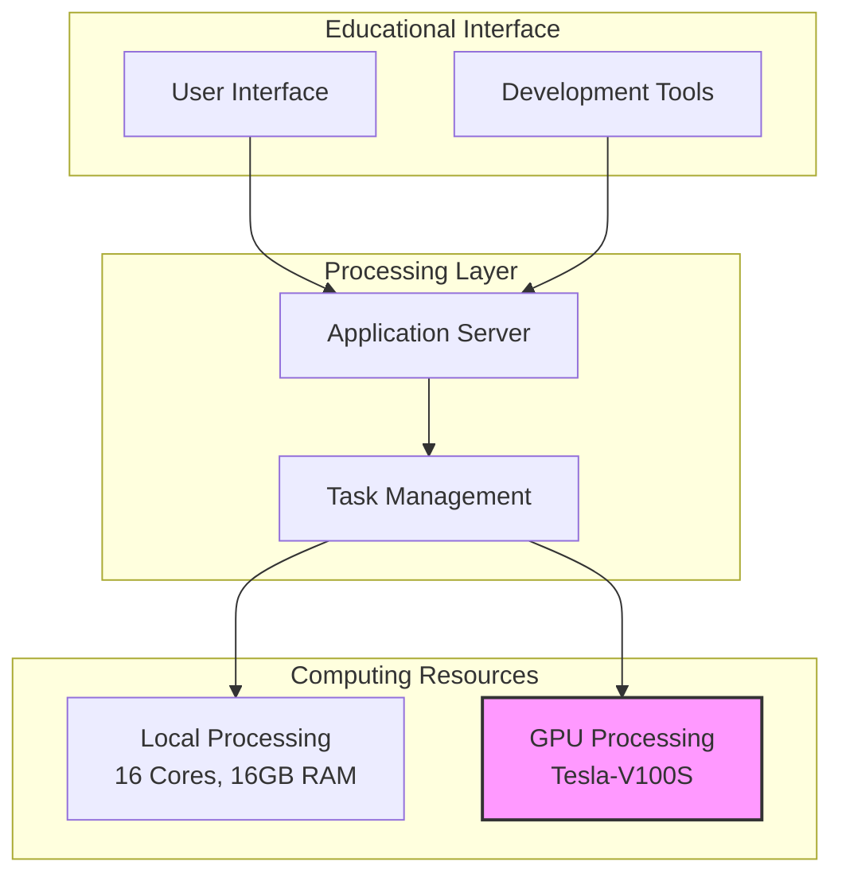
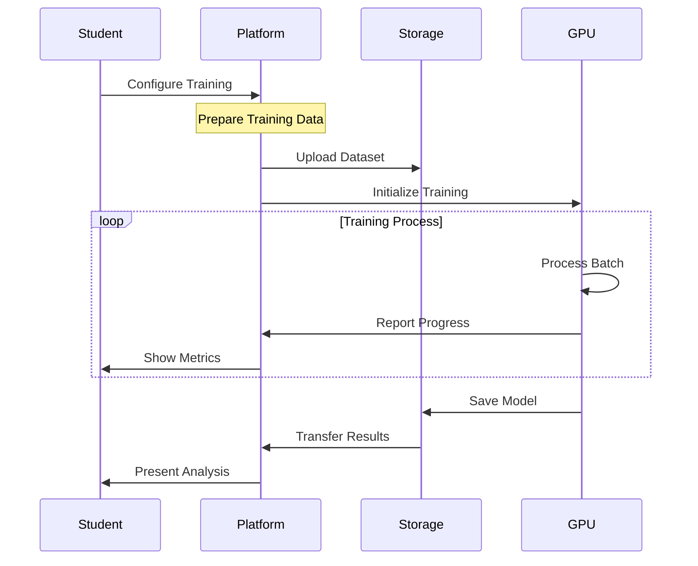
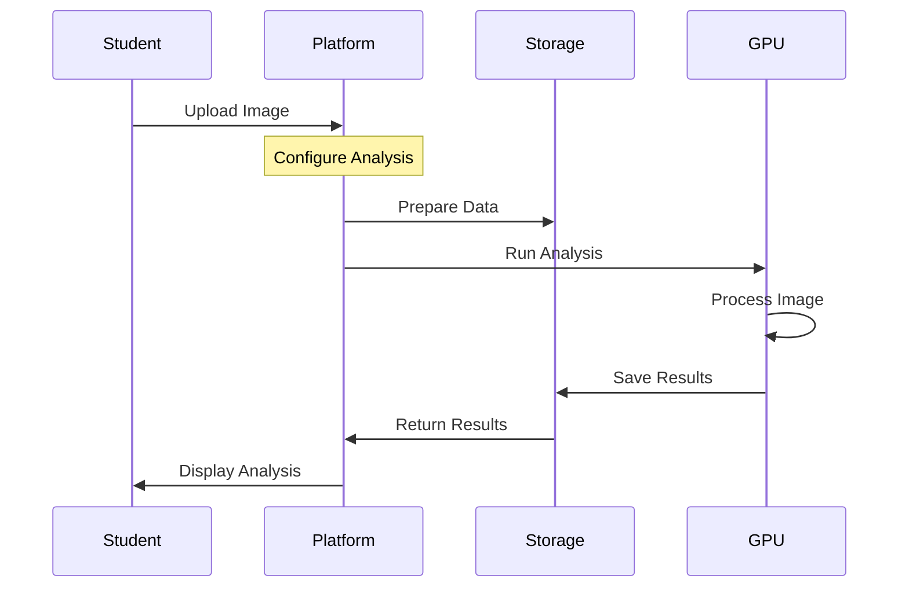
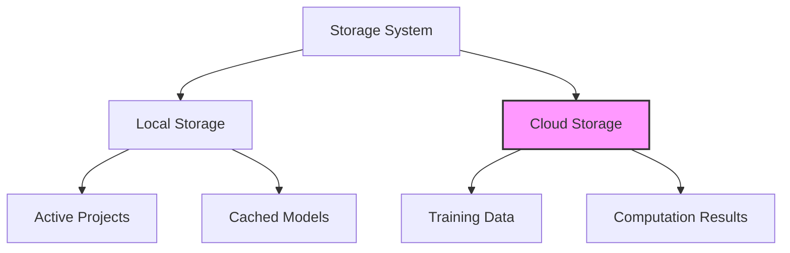

# AI Learning Platform: Comprehensive Technical Documentation

## Executive Summary

The AI Learning Platform represents an innovative approach to artificial intelligence education, bridging the gap between theoretical knowledge and practical implementation. By combining powerful computing resources with an intuitive educational interface, we provide students with hands-on experience in real-world AI development while giving institutions the flexibility and efficiency of cloud-based GPU computing.

## Educational Context and Impact

### Transforming AI Education

Traditional AI education often faces significant challenges in providing students with practical experience. Our platform transforms how students learn AI by providing a complete, hands-on learning environment that mirrors real-world AI development workflows.

### Educational Workflow Overview

The platform guides students through a comprehensive AI development process:

1. **Image Import and Preparation**
   Students begin by importing their image data into the platform. The system automatically processes these images through tiling, breaking them into manageable pieces while maintaining their spatial relationships. This step teaches students about data preparation and the importance of proper input formatting for AI systems.

2. **Data Annotation Phase**
   Using an integrated annotation tool based on Django Labeller, students learn to create high-quality training data. This hands-on experience helps them understand the critical role of data labeling in AI development and the importance of annotation quality for model performance.

3. **Training Set Creation**
   Students learn to organize their annotated data into training sets, gaining practical experience in dataset curation and understanding the importance of data organization in AI projects. They can create multiple training sets to experiment with different data combinations.

4. **Model Training**
   The platform handles the complex GPU resource management behind the scenes while students configure and monitor their training processes. They can observe real-time training metrics and learn about:
   - Model configuration and hyperparameters
   - Training optimization
   - Resource utilization
   - Performance evaluation

5. **Inference and Analysis**
   Students can apply their trained models to new images, experiencing the full AI development cycle. They learn about:
   - Model deployment
   - Inference optimization
   - Result analysis
   - Performance metrics

## System Architecture and Implementation

### Core Architecture

The platform's architecture is designed to provide seamless integration between user-facing educational components and powerful computing resources. The system is divided into three main layers that work together to deliver both educational value and computational power:

The Educational Interface layer serves as the entry point for students and educators, providing both web-based access and local development tools. This flexibility allows students to choose their preferred working environment while maintaining consistent access to computing resources.

The Processing Layer coordinates all system operations through the Application Server and Task Management system. It efficiently distributes computing tasks based on educational needs and resource availability.

The Computing Resources layer combines local processing power for routine tasks with GPU resources for intensive computations, ensuring optimal performance for all types of educational activities.

### Computing Infrastructure

The platform operates on a hybrid infrastructure that combines local computing resources for routine operations with powerful GPU capabilities for intensive computations:

**Local Server Resources**
- 16 vCores for routine processing
- 16 GB System Memory
- 160 GB Storage
- Handles web interface, data preparation, and coordination

**GPU-Enabled Virtual Machine**
- Processing Power: 13 CPU cores
- System Memory: 40 GiB RAM
- GPU: NVIDIA Tesla V100S
  - 32GB GPU Memory
  - 130 TeraFLOPS AI Performance
  - Designed for deep learning workloads

The platform utilizes a custom Docker image (ghcr.io/mupacif/axons-ovh:latest) that contains:
- The complete AI training and inference pipeline
- Optimized deep learning frameworks
- Resource management tools
- Automated data handling utilities

This containerized approach ensures:
- Consistent development environments
- Optimal resource utilization
- Streamlined deployment
- Version control of AI tools

## Technical Workflows

### Training Process

The training process demonstrates the platform's approach to managing complex GPU computations while maintaining an educational focus:

This workflow encompasses several key stages:

1. **Configuration Phase**
   - Students set training parameters
   - System validates configuration
   - Resources are allocated
   - Training data is prepared

2. **Training Execution**
   - GPU resources are initialized
   - Training process begins
   - Real-time progress monitoring
   - Automatic checkpointing

3. **Results Management**
   - Model artifacts are saved
   - Results are transferred
   - Resources are released
   - Analysis is presented

### Inference Process

The inference workflow demonstrates how students apply their trained models:

The inference process includes several stages:

1. **Input Processing**
   - Image upload and validation
   - Resolution configuration
   - Format conversion
   - Data preparation

2. **Inference Execution**
   - Model loading
   - GPU allocation
   - Image processing
   - Result generation

3. **Results Handling**
   - Data validation
   - Results transfer
   - Resource cleanup
   - Analysis presentation

### Storage Architecture

The platform implements an efficient storage system that balances performance with resource utilization:

This architecture incorporates several key components:

1. **Local Storage Layer**
   - Manages active project data
   - Stores frequently used models
   - Handles temporary computations
   - Provides fast access to common resources

2. **Cloud Storage Layer**
   - Stores training datasets
   - Manages computation results
   - Handles temporary data
   - Enables efficient cleanup

3. **Caching Strategy**
   - Maintains frequently used models
   - Optimizes data access
   - Reduces transfer overhead
   - Improves response times

This comprehensive system enables institutions to provide advanced AI education while maintaining efficient resource utilization and ensuring a smooth learning experience for students.
