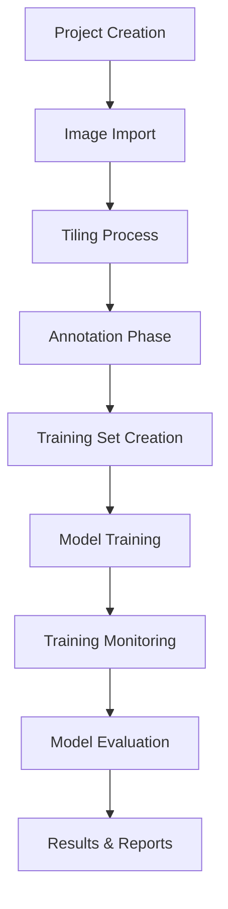
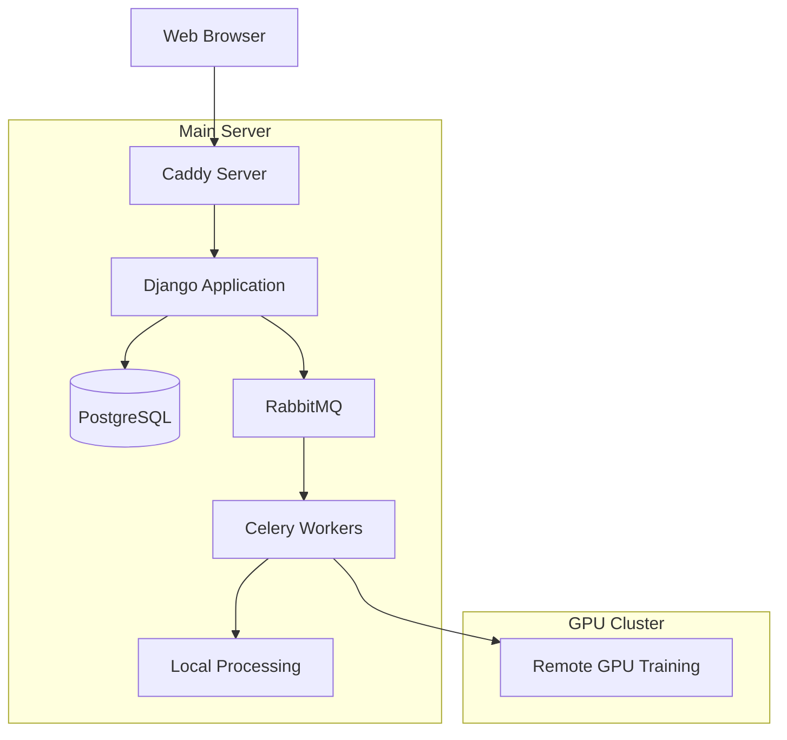
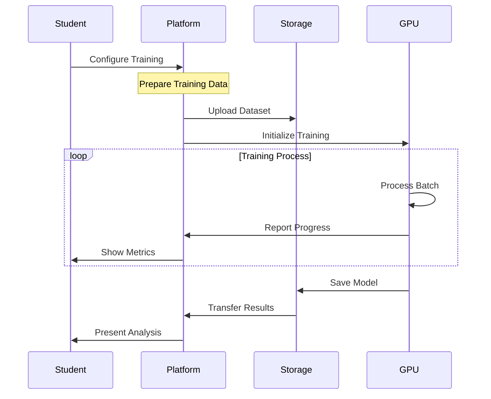
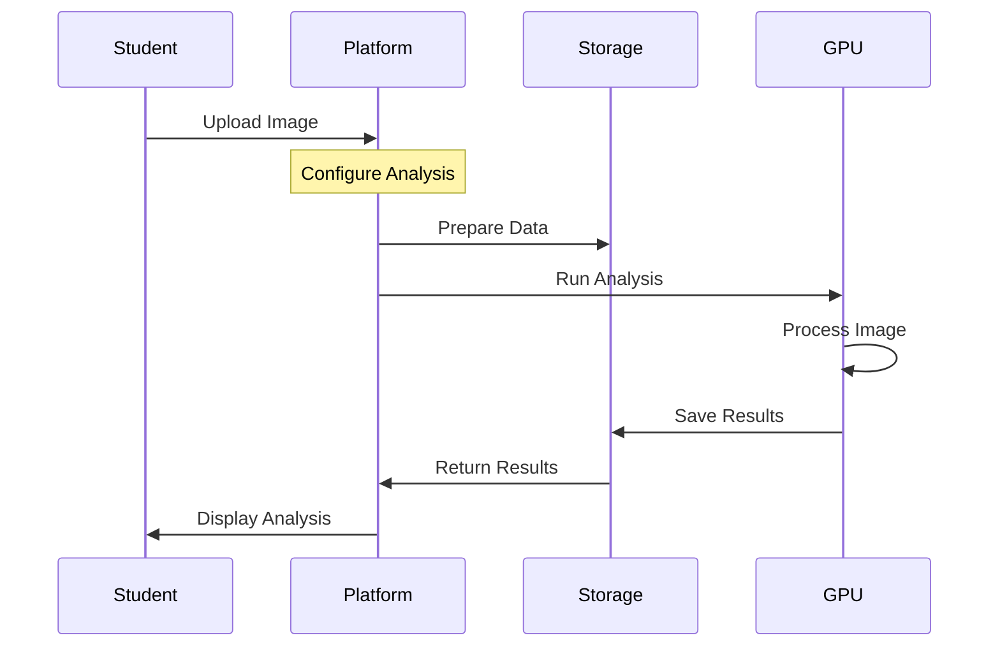

# AI Learning Platform: Technical Implementation and Educational Workflows

## Executive Summary

The AI Learning Platform represents a transformative approach to artificial intelligence education, bridging the crucial gap between theoretical knowledge and practical implementation. Our platform enables students to experience the complete AI development lifecycle while providing educational institutions with a scalable, efficient solution for hands-on AI education. By combining a sophisticated web application with powerful GPU computing resources, we create an environment where students can develop real-world AI skills through practical application.

## Understanding the AI Development Journey

The platform guides students through the complete process of AI development, mirroring real-world workflows while providing educational support at each step. This comprehensive approach ensures students understand not just the theory, but the practical implementation of AI systems.

### Data Preparation and Image Processing

Students begin their AI journey with raw image data, learning how to prepare real-world data for AI processing. When students upload their images, the system automatically processes them through a tiling system, breaking larger images into manageable pieces while maintaining spatial relationships. This process teaches fundamental concepts about data preparation and its impact on AI system performance.

During this phase, students develop a practical understanding of image resolution and its effects on AI processing. They learn to manage large datasets efficiently and recognize the critical relationship between data quality and model performance. This hands-on experience with data preparation establishes a strong foundation for more advanced AI concepts.

### The Art of Annotation

The annotation phase represents a critical step where students develop a deep understanding of what they want their AI models to learn. Using an integrated annotation tool based on Django Labeller, students mark important features in their images, creating the training data that will guide their AI models' learning process.

As students annotate their images, they begin to understand the connection between human perception and machine learning. They learn to maintain consistency in their labeling approach and recognize how annotation quality directly impacts model performance. This direct interaction with the data helps solidify the connection between human understanding and machine learning capabilities.

### Creating Training Sets

After preparing and annotating their images, students learn to organize their data into training sets. This phase teaches crucial concepts about data organization and model training. Students can create multiple training sets, experimenting with different data combinations to understand how their choices impact model performance.

This process helps students understand data distribution and balance, the importance of diverse examples, and how to structure data for effective learning. They develop practical skills in organizing and validating their datasets, essential knowledge for real-world AI development.

### The Training Process

The training phase represents the moment where theory meets practice. Students configure and initiate training jobs using powerful GPU resources, all managed seamlessly by the platform. During training, students observe real-time progress, monitor performance metrics, and understand resource utilization. This phase demystifies the AI training process, showing students exactly how their annotated data transforms into a functional model.

### Analysis and Inference

In the final phase, students apply their trained models to new images, completing the AI development cycle. This phase brings everything together, demonstrating how their careful work in previous stages contributes to a functional AI system. Students test their models on new images, analyze performance, and extract meaningful results, gaining valuable insights into real-world AI deployment.

## Technical Implementation

### Complete Workflow Progression

The platform implements a structured workflow that guides users through each phase of AI development:

Each step in this workflow is carefully orchestrated across our system components, ensuring efficient resource utilization while maintaining an optimal learning experience.

### System Architecture

The platform's architecture distributes tasks across appropriate computing resources based on their requirements:

This architecture ensures that each type of processing occurs on the most appropriate resources:

The local server handles operations that require rapid response and moderate computing power:
- Project management and user interface operations
- Image tiling and preprocessing
- Data validation and preparation
- Result compilation and presentation

The GPU-enabled virtual machines manage computationally intensive tasks:
- Neural network training
- Model inference and analysis
- Complex mathematical computations
- Performance-critical operations

### Computing Infrastructure

The platform utilizes two distinct types of computing resources:

Local Server Resources:
- 16 vCores for processing
- 16 GB System Memory
- 160 GB Storage
- Handles web interface and data preparation

GPU-Enabled Virtual Machines:
- Processing Power: 13 CPU cores
- System Memory: 40 GiB RAM
- GPU: NVIDIA Tesla V100S with 32GB GPU Memory
- 130 TeraFLOPS AI Performance

Our custom Docker image (ghcr.io/mupacif/axons-ovh:latest) encapsulates the complete AI pipeline, ensuring consistent environments and optimal resource utilization across all deployments.

### Training Process Implementation

When students initiate training, the system orchestrates a complex sequence of operations across multiple components. The platform handles data preparation, GPU resource allocation, and model training while providing real-time feedback to students.

### Inference Implementation

The inference system enables efficient model application and result analysis. This streamlined workflow allows students to focus on understanding model performance and interpreting results while the platform manages all technical complexities.

## Conclusion

The AI Learning Platform provides a comprehensive solution for modern AI education, combining powerful computing resources with an intuitive learning interface. Its implementation of industry-standard tools and workflows, supported by high-performance GPU computing, enables universities to deliver practical, hands-on AI education at scale. Through careful attention to both educational needs and technical implementation, the platform creates an environment where students can develop real-world AI skills while institutions maintain efficient resource utilization.
