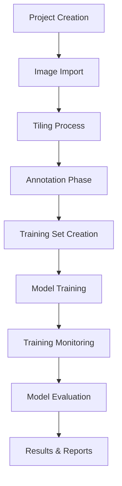
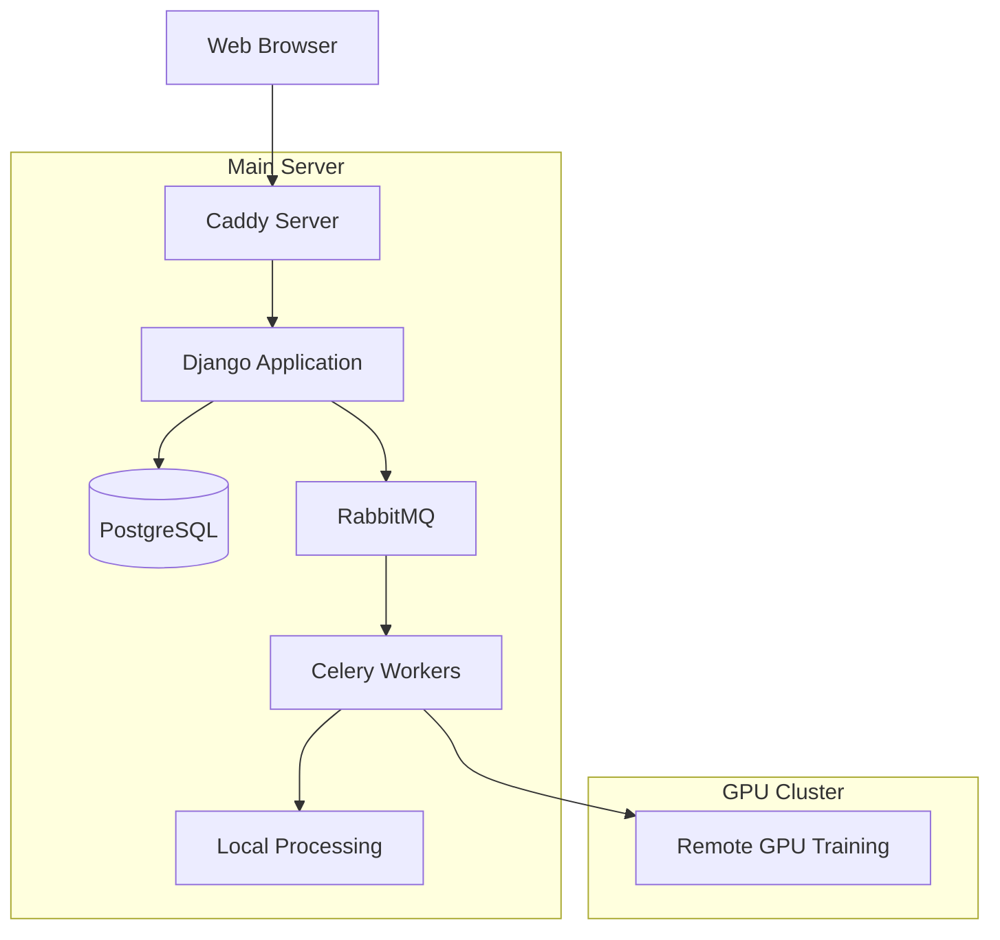
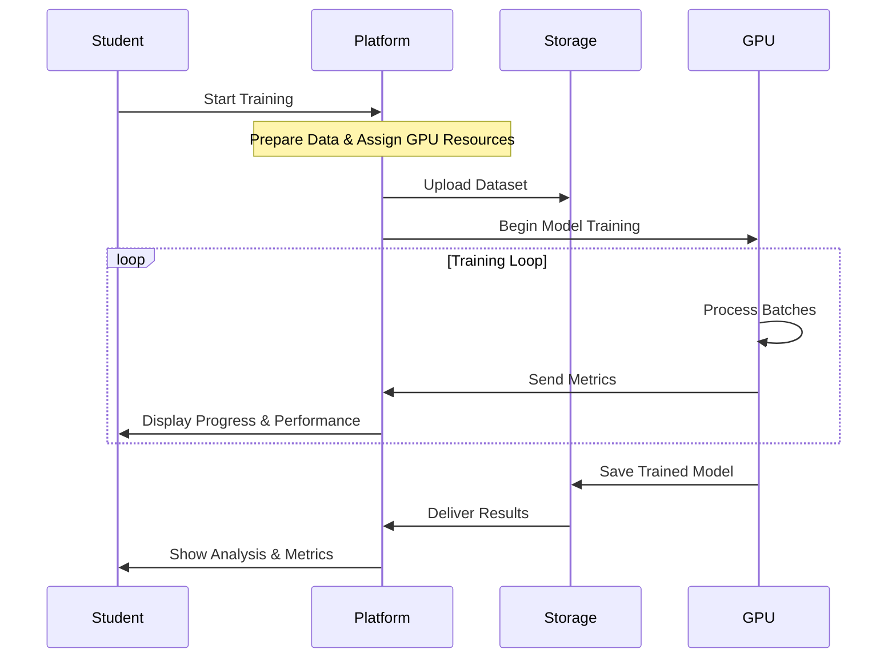
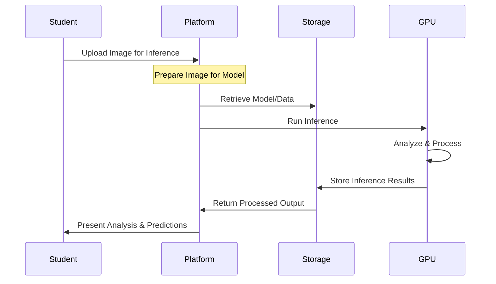

# AI Learning Platform: Technical Overview and Educational Workflow

## Executive Summary

Our AI Learning Platform provides a hands-on environment for students to gain practical, real-world experience in artificial intelligence development. By blending an intuitive web interface, automated data preparation, annotation tools, and powerful GPU computing, the platform helps learners understand the full AI development lifecycle—from preparing raw data to training, evaluating, and deploying models. With its scalable, efficient infrastructure, educational institutions can offer students a modern and practice-oriented AI learning experience.

## Understanding the AI Development Journey

The platform closely mirrors how AI professionals work, guiding students through every stage of the development process while ensuring they have the support they need. By working directly with real data, students gain insights into the challenges and best practices of building AI solutions.

### Data Preparation and Image Processing

Students start by uploading raw images. The platform then automatically processes these images into smaller “tiles,” making it easier to handle large datasets and maintain spatial relationships within the data. This experience helps students appreciate the importance of proper data preparation, resolution choices, and data quality in building successful AI models.

### The Art of Annotation

Next, students use a built-in annotation tool, based on Django Labeller, to highlight the features in their images that they want the model to learn. This step makes the connection between human perception and machine learning clear. By learning to label data consistently and accurately, students see firsthand how their annotations influence the quality and reliability of the final model.

### Creating Training Sets

After annotation, students group their labeled images into training sets. This teaches them how to balance datasets, ensure diversity, and structure data so that models can learn effectively. By experimenting with different training sets, they discover how the makeup of a dataset can impact overall model performance.

### The Training Process

When students are ready to train their models, they initiate training jobs on powerful GPU resources. They monitor progress in real time, seeing how computational power, resource management, and proper configuration come together to transform annotated images into functional AI models. This stage helps students understand the complexity of training and the factors that influence model outcomes.

### Analysis and Inference

Finally, students apply their trained models to new images to test performance and accuracy. This closing loop shows them the end-to-end process in action, allowing them to interpret results, troubleshoot shortcomings, and learn how fine-tuning and adjustments can improve outcomes. Seeing the entire pipeline come to life helps them understand what it takes to deploy AI in real-world scenarios.

## Technical Implementation

### Workflow Overview

The platform’s workflow is carefully structured, leading students through each step from project creation to results analysis:

Each phase is backed by a robust technical foundation that ensures users get immediate feedback while complex processing happens behind the scenes.

### System Architecture

To handle diverse tasks—ranging from quick web requests to intensive GPU training—the platform uses a distributed architecture:

#### Main Server
Handles project management, user interactions, data preprocessing, and result presentation.

#### GPU Cluster
Takes on computationally heavy tasks like model training and inference, using dedicated GPU resources for maximum efficiency.

### Computing Infrastructure

We use two main resource types to balance responsiveness with computational muscle:

#### Local Server:
- 16 vCores, 16 GB RAM, 160 GB storage
- Manages data preparation, interface, and coordination tasks.

#### GPU-Enabled Virtual Machines:
- 13 CPU cores, 40 GiB RAM
- NVIDIA Tesla V100S with 32GB GPU memory (130 TFLOPS AI performance)
- Focused on training and inference workloads that need heavy computing power.

All components run in a standardized environment (our Docker image: `ghcr.io/mupacif/axons-ovh:latest`), ensuring consistent performance and reliability.

### Training Process Implementation

### Inference Implementation

## Conclusion

Our AI Learning Platform offers a full-spectrum, hands-on learning experience for modern AI education. By integrating data handling, annotation, training, and inference in one seamless solution, students gain a true-to-life understanding of developing and deploying AI systems. Educators and institutions benefit from scalable infrastructure, industry-standard tools, and a straightforward workflow that prepares students for the demands of real-world AI projects.
